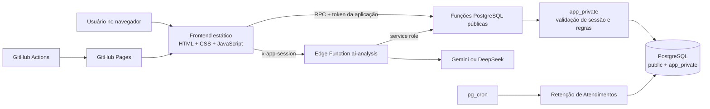
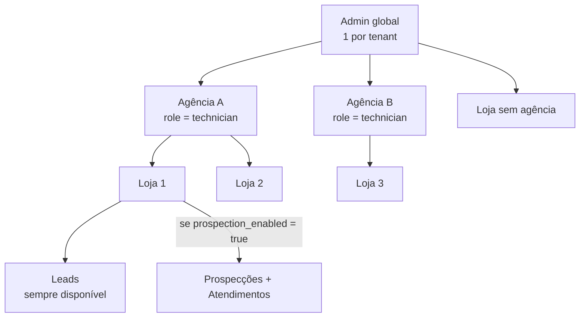
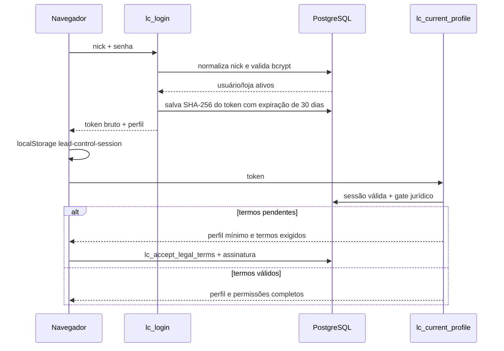
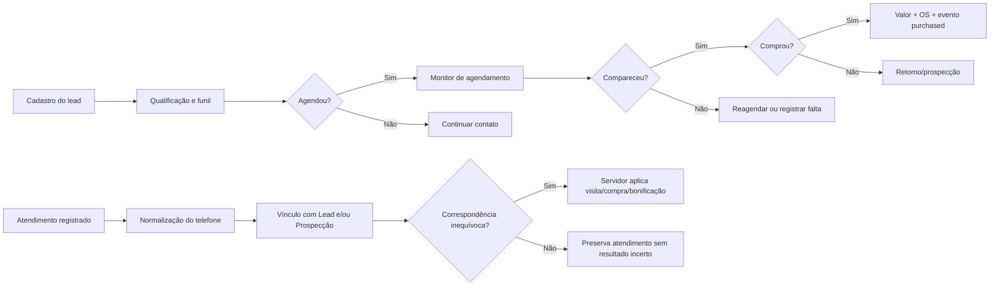
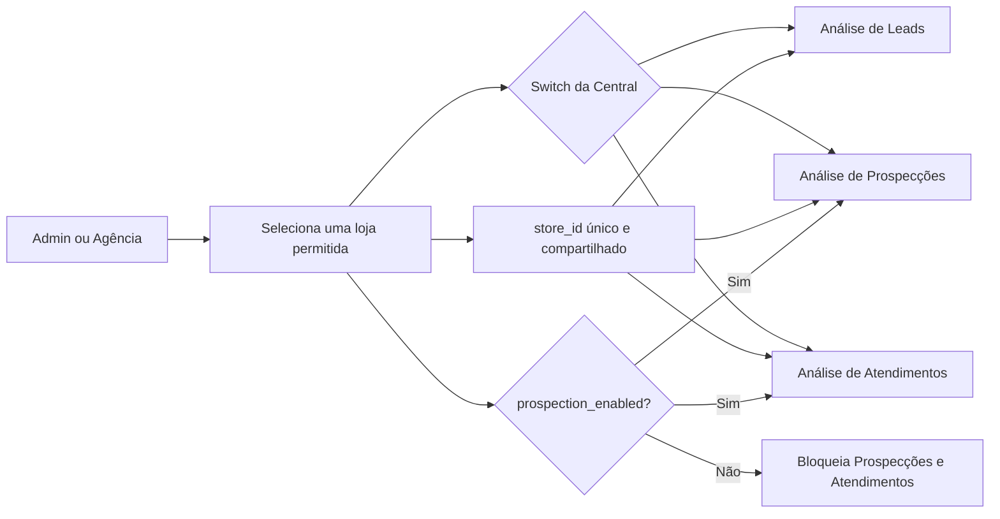

# Controle de Leads — documentação completa do projeto

> Retrato técnico e funcional verificado em **18 de agosto de 2026**.
>
> Este documento descreve o estado consolidado do código e do projeto Supabase `menlvmsgkhgqxiydphbn`. A retirada de anúncios/atribuição foi aplicada e verificada no banco remoto em 18 de agosto de 2026; banco, Edge Functions e frontend continuam tendo ciclos de implantação independentes.

## 1. Resumo executivo

O Controle de Leads é um SaaS B2B para óticas. Ele possui uma interface web única, três módulos operacionais e três níveis de conta:

- **Admin:** proprietário global do ambiente e de todos os dados do tenant.
- **Agência:** perfil gravado no banco como `technician`; administra a própria carteira de clientes.
- **Cliente/loja:** opera somente os dados da sua loja.

Os módulos atuais são:

1. **Leads:** cadastro, acompanhamento, agenda, funil, inteligência comercial nativa, relatórios e exportações.
2. **Prospecções:** carteira de prospecção, profissionais, metas, bonificação, resultados e análises.
3. **Atendimentos:** registro de atendimentos feitos na loja, vínculo automático por telefone e atualização controlada de resultados.

O módulo **Leads** está disponível para todas as lojas. **Prospecções e Atendimentos formam uma única licença adicional**: `stores.prospection_enabled`. Atendimentos não possui uma licença separada.

Não existe ferramenta, conector, rastreador ou estrutura de dados para WhatsApp, Meta Ads ou Google Ads. Foram retirados frontend, tabelas, campos de atribuição, credenciais, filas, workers, webhooks, Edge Functions e agendamentos dessas integrações. `channel` e `campaign` continuam sendo campos comerciais comuns, preenchidos pela loja; valores históricos que mencionem uma plataforma são apenas texto, não conexão ou rastreamento externo. O provedor Google Gemini continua disponível exclusivamente para IA e não tem relação com Google Ads.

Admin e Agência acessam uma **Central de análise única**. Depois de selecionar uma loja, um switch alterna entre Leads, Prospecções e Atendimentos sem trocar a loja nem combinar bases. As duas últimas abas respeitam a licença conjunta `prospection_enabled`.

## 2. Arquitetura geral

O frontend é uma aplicação estática em HTML, CSS e JavaScript puro. Não há framework, bundler, `package.json` ou etapa de compilação. A persistência e as regras críticas ficam no Supabase/PostgreSQL; integrações sensíveis ficam em Edge Functions.



### 2.1 Tecnologias e dependências

| Camada | Tecnologia | Uso |
|---|---|---|
| Interface | HTML5 | Estrutura de todas as telas e modais. |
| Interface | CSS3 | Tema claro/escuro, componentes, módulos e responsividade. |
| Interface | JavaScript ES | Estado, renderização, validações, gráficos próprios, XLSX e chamadas ao backend. |
| Ícones | Font Awesome 6.5.2 via CDN | Ícones visuais da interface. |
| Cliente de dados | `@supabase/supabase-js@2` via CDN | Chamadas RPC ao Supabase. |
| Banco | Supabase PostgreSQL | Dados, permissões, regras, auditoria e retenção. |
| Funções | Supabase Edge Functions/Deno | Proxy autenticado e streaming da IA. |
| Criptografia SQL | `pgcrypto` | Senhas, tokens, hashes e evidências. |
| Agendamento | `pg_cron` | Retenção diária de Atendimentos. |
| Hospedagem web | GitHub Pages | Publicação do site estático. |
| PWA | Web App Manifest | Instalação em tela inicial e identidade visual. |
| Persistência local | `localStorage` e IndexedDB | Sessão, tema, módulo, chats e autorizações de backup. |
| IA externa | Gemini ou DeepSeek | Análises comerciais agregadas. |

### 2.2 Características importantes

- É uma **SPA sem roteador por URL**: as telas são seções alternadas por JavaScript.
- Admin e Agência usam uma única Central de análise; o estado compartilhado mantém uma loja por vez e o switch apenas troca o tipo de leitura.
- O Supabase Auth **não é usado para login do produto**. Existe autenticação própria em `app_users` e `app_sessions`.
- A chave `anon` do Supabase está no navegador, como esperado para cliente público. A segurança depende de RLS, revogação de acesso direto e validação de sessão dentro das RPCs.
- Não há Service Worker. O app é instalável pelo manifesto, mas **não tem cache offline completo**.
- O fuso operacional padrão é `America/Sao_Paulo`; datas visuais usam `pt-BR`.

## 3. Hierarquia de contas, dados e licenças



### 3.1 Regras de propriedade

- `admin_user_id` identifica o tenant e aparece em praticamente todas as tabelas de negócio.
- `store_id` impede a mistura de informações entre clientes.
- `stores.technician_user_id` vincula uma loja à agência responsável.
- Uma conta `store` também aponta para a loja em `app_users.store_id`.
- O Admin pode acessar qualquer loja do próprio tenant.
- A Agência pode acessar somente lojas em que `technician_user_id` é o seu usuário.
- A Loja pode acessar somente `app_users.store_id`.
- Análises e IA trabalham com **uma loja selecionada por vez**; dados de lojas diferentes não são combinados.

### 3.2 Limites de plano

| Campo | Significado |
|---|---|
| `app_users.store_limit` | Quantidade máxima de clientes que uma agência pode cadastrar. |
| `app_users.prospection_store_limit` | Quantidade máxima de clientes da agência que podem ter Prospecções + Atendimentos. |
| `stores.prospection_enabled` | Liga ou desliga o pacote Prospecções + Atendimentos para a loja. |

Ao reduzir um limite abaixo do uso atual, o sistema preserva as lojas que já estavam ativas. Novas ativações ficam bloqueadas até a agência voltar ao limite; a escolha de quais clientes desativar é administrativa e não automática.

### 3.3 Matriz de permissões

| Recurso | Admin | Agência | Loja |
|---|:---:|:---:|:---:|
| Entrar e alterar tema | Sim | Sim | Sim |
| Ver todos os clientes do tenant | Sim | Não | Não |
| Ver clientes da própria carteira | Sim | Sim | Própria loja |
| Criar/editar/excluir agência | Sim | Não | Não |
| Criar/editar/excluir loja | Sim | Própria carteira | Não |
| Definir limites e licenças | Sim | Não | Não |
| Operar Leads | Sim | Sim | Sim |
| Editar categorias da loja | Sim | Sim | Sim, própria loja |
| Operar Prospecções | Sim | Sim | Sim, se licenciada |
| Operar Atendimentos | Sim | Sim | Sim, se licenciada |
| Ver análises | Sim | Sim, própria carteira | Própria loja |
| Exportar dados | Sim | Sim, própria carteira | Própria loja |
| Configurar backup em HD | Sim | Sim | Não |
| Configurar IA central | Sim | Não | Não |
| Usar IA de análise | Sim | Sim | Não |
| Administrar termos legais | Sim | Não | Não |
| Acessar a central de termos assinados | Sim | Não | Não |
| Assinar termos obrigatórios | Sim | Sim | Sim |

## 4. Hierarquia de arquivos

```text
lead-control-/
├── index.html                         # Estrutura da SPA e todos os mounts/modais
├── app.js                             # Núcleo: sessão, Leads, contas, análises, IA, backup
├── styles.css                         # Design system e telas do núcleo
├── mobile.css                         # Responsividade compartilhada
├── prospections.js / prospections.css # Módulo de Prospecções
├── prospec-original.css               # Camada visual original ativada pelo módulo
├── attendances.js / attendances.css   # Módulo de Atendimentos
├── manifest.webmanifest               # Manifesto instalável/PWA
├── favicon.ico e logo__.png           # Identidade na raiz
├── assets/                            # Ícones, logo e preview social
│   ├── logo-source.png
│   ├── link-preview.png
│   ├── app-icon-192.png
│   ├── app-icon-512.png
│   ├── maskable-icon-512.png
│   ├── apple-touch-icon.png
│   ├── favicon-16.png
│   ├── favicon-32.png
│   └── site-icon.png
├── database.sql                       # Base consolidada + histórico incremental
├── attendance_module.sql              # Schema e RPCs de Atendimentos
├── lead_intelligence_update.sql       # Inteligência comercial nativa, sem atribuição externa
├── *_update.sql                       # Migrações incrementais históricas
├── *_qa.sql                           # QA SQL transacional
├── remove_whatsapp_module.sql         # Retirada destrutiva do módulo descontinuado
├── supabase/
│   ├── config.toml                    # Configuração local das Edge Functions
│   ├── migrations/
│   │   └── 20260818171504_remove_marketing_attribution.sql
│   └── functions/
│       └── ai-analysis/index.ts        # Única Edge Function do produto
└── .github/workflows/pages.yml         # Deploy do frontend no GitHub Pages
```

### 4.1 Diretório local legado `prospec/`

`prospec/` é um repositório local aninhado e ignorado pelo Git principal. Ele guarda a versão original independente do sistema de prospecção e SQLs antigos, servindo apenas como referência. O produto publicado usa `prospections.js`, `prospections.css`, `prospec-original.css` e as RPCs atuais do projeto principal.

Arquivos `prospec-backup*.json` também são ignorados e podem conter dados pessoais. Não devem ser commitados.

### 4.2 Ordem de carregamento do navegador

1. `styles.css`
2. `prospections.css`
3. `attendances.css`
4. `prospec-original.css` inicialmente desabilitado
5. `mobile.css`
6. Font Awesome
7. Supabase JS v2
8. `app.js`
9. `prospections.js`
10. `attendances.js`

Os módulos expõem pontes globais:

- `window.ProspectionsModule`
- `window.AttendancesModule`

`app.js` fornece a sessão, lojas, dados e navegação; cada módulo monta sua própria interface no contêiner correspondente.

## 5. Mapa de telas e interface

```text
Aplicação
├── Login
│   ├── Nick
│   ├── Senha
│   └── Aceite legal obrigatório, quando pendente
├── Barra superior
│   ├── Identidade, avatar e perfil
│   ├── Seletor: Leads | Prospecções | Atendimentos
│   ├── Data
│   ├── Alertas de agendamento
│   ├── Administração/configurações, conforme perfil
│   ├── Tema
│   └── Sair
├── Área Admin/Agência
│   ├── Clientes
│   ├── Agências, somente Admin
│   ├── Central de análise: Leads | Prospecções | Atendimentos
│   ├── Backups
│   ├── Central jurídica, somente Admin
│   └── Configuração de IA, somente Admin
├── Área da loja — Leads
│   ├── Resumo e indicadores
│   ├── Monitor de agendamentos atrasados
│   ├── Formulário de lead
│   ├── Pesquisa e filtros
│   ├── Lista/cartões de leads
│   ├── Categorias e opções
│   └── Exportação
├── Prospecções
│   ├── Operação
│   ├── Atendimentos para prospectar
│   ├── Gestão
│   ├── Análise
│   ├── Bonificação
│   ├── Configurações
│   └── Importação/exportação
├── Atendimentos
│   ├── Formulário
│   ├── Indicadores
│   ├── Filtros
│   └── Histórico
└── Modais
    ├── Detalhe/edição de lead
    ├── Conta, loja e agência
    ├── Confirmação e alterações não salvas
    ├── Agendamento
    ├── Inspetor de analytics
    ├── Chat, histórico e configuração de IA
    ├── Aceite de termos
    └── Documento jurídico
```

### 5.1 Design system e responsividade

- Paleta base: fundo `#e8e8e8`, superfície `#ffffff`, texto `#171717`, verde `#16855f`, azul `#2563a5`, âmbar `#b46d12` e rosa `#b02f4c`.
- Identidade por módulo: Leads usa superfícies neutras mais escuras; Prospecções usa acentos e fundos azulados; Atendimentos usa acentos e fundos esverdeados. A Central de análise mantém essa identidade no switch e no painel ativo.
- Raio base: `8px`.
- Fonte: pilha de sistema/Inter, sem download obrigatório de uma fonte externa.
- Tema escuro: classes `body.is-dark` e `body.is-dark-mode` atendem partes antigas e novas.
- Breakpoints compartilhados principais: `900px` e `720px`, com ajustes específicos em cada módulo.
- No celular, a intenção atual é preservar a mesma interface e todos os recursos, apenas em uma composição mais densa.
- Para Agência, a navegação superior possui somente Clientes, Análise e Backups; `has-three-sections` centraliza os três itens porque a central de termos assinados é exclusiva do Admin.
- Controles de formulário usam ao menos `16px` no mobile para evitar zoom automático do iOS.
- `safe-area-inset-*`, `min-width: 0`, quebra de texto e contenção de mídia evitam cortes e rolagem horizontal acidental.

## 6. Sessão, autenticação e termos legais

### 6.1 Fluxo de entrada



### 6.2 Detalhes de segurança da sessão

- O nick é normalizado em minúsculas, com espaços convertidos em hífen.
- Senhas são armazenadas com bcrypt por `crypt(..., gen_salt('bf'))`.
- O token bruto aleatório é entregue somente ao navegador.
- `app_sessions.token_hash` guarda SHA-256, não o token bruto.
- A sessão expira em 30 dias e pode ser revogada no logout.
- `app_private.session_user` valida token, expiração, revogação, usuário ativo, loja ativa e atualiza `last_seen_at`.
- A sessão local fica em `localStorage` sob `lead-control-session`.
- Toda RPC de negócio revalida a sessão; esconder um botão não é considerado autorização.

### 6.3 Gate jurídico

Quando há termos ativos não aceitos, apenas o carregamento mínimo do perfil e as operações jurídicas continuam disponíveis. O restante das RPCs é bloqueado até o aceite.

O aceite registra:

- versão, título, conteúdo e hash do documento;
- conta, tenant e snapshots de agência/loja;
- nome e cargo do signatário;
- CPF em hash e somente os quatro últimos dígitos visíveis;
- assinatura em PNG/data URL e hash próprio;
- confirmações explícitas;
- IP, User-Agent, timezone e horário do cliente;
- `evidence_hash`, vinculando documento, pessoa, assinatura e contexto.

O Admin pode consultar pendências, aceites válidos/desatualizados e baixar um comprovante HTML imprimível.

## 7. Fluxos ponta a ponta

### 7.1 Criação da estrutura B2B

1. O Admin global é provisionado diretamente no banco; não existe RPC pública para criar outro Admin.
2. O Admin cria uma Agência, informando nome, nick, senha, limite de clientes e limite de licenças Prospecções.
3. Admin ou Agência cria uma loja dentro do escopo permitido.
4. A loja recebe conta de login e sempre tem Leads.
5. O Admin pode ativar `prospection_enabled`, respeitando a franquia da Agência.
6. Quando a licença é ativada, Prospecções e Atendimentos tornam-se acessíveis juntos.

### 7.2 Lead até atendimento e compra



### 7.3 Central única de análise



Ao trocar a loja, o sistema invalida a renderização anterior. Os módulos embutidos desmontam eventos e DOM quando saem de foco; uma geração de requisição impede que uma resposta antiga reapareça no cliente novo.

## 8. Módulo Leads

### 8.1 Cadastro e edição

Campos principais:

- nome e telefone;
- data do contato;
- canal, campanha, início da conversa e conclusão;
- situação do ciclo de vida: `new`, `contacted`, `qualified`, `scheduled`, `visited`, `won` ou `lost`;
- responsável e qualificação;
- agendou, data e horário;
- visitou;
- comprou, valor da compra e ordem de serviço;
- observações;
- categorias personalizadas da loja;
- inteligência: ciclo de vida, qualificação, responsável, e-mail, motivo de perda, timestamps do funil e cliente recorrente.

Regras principais:

- Agendamento “Sim” exige data; o horário é opcional.
- Visita “Sim” exige uma resposta de compra.
- Compra “Sim” exige valor maior que zero e ordem de serviço.
- O salvamento preferencial usa `lc_upsert_lead_with_intelligence`, mantendo lead, valores personalizados e inteligência na mesma operação.
- Existe fallback compatível com `lc_upsert_lead` seguido de `lc_save_lead_intelligence`.

### 8.2 Categorias e opções

Grupos padrão por loja:

- Canal: Instagram, Facebook e Ligação.
- Campanha: Orgânico, Anúncio e Indicação.
- Início da conversa: preço, consulta, armação e lente.
- Conclusão: Aguardando, Retornar e Finalizado.
- Visitou, Comprou e Agendou: opções fixas Sim/Não.

É possível renomear rótulos dos grupos, criar categorias personalizadas, adicionar/editar/excluir opções e mudar a ordem. Opções fixas de Sim/Não não podem ser adulteradas.

Não existe opção funcional ou ferramenta de WhatsApp. Valores históricos já salvos em campos textuais não são interpretados, conectados ou rastreados pelo sistema.

### 8.3 Agenda

O monitor considera pendentes os leads com:

- `scheduled = 'Sim'`;
- data anterior ao dia atual;
- `visited != 'Sim'`.

As ações permitem ligar pelo discador do aparelho, marcar comparecimento, registrar que não veio/reagendar ou abrir a edição completa.

### 8.4 Análise de Leads

Esta análise aparece na Central única, na aba Leads. O contexto é `selectedAnalyticsStoreId`, e os cálculos usam somente `getAnalyticsBaseLeads()`/`getAnalyticsLeads()` da loja escolhida. Filtros disponíveis incluem período, canal, campanha, conclusão, ciclo de vida, qualificação, visita, agendamento, compra e categorias personalizadas.

Indicadores e visualizações incluem:

- volume de leads, qualificados, agendados, visitas e vendas;
- conversões entre etapas;
- receita, ticket médio e taxa de comparecimento;
- rankings por canal/campanha/opção;
- gráficos de pizza, barras e linha;
- comparação com período anterior;
- inspetor de registros por fatia;
- qualidade e consistência dos dados.

Não há custo de mídia, atribuição, CPL, CAC, ROAS ou dados importados de plataformas de anúncio. Canal e campanha são dimensões internas dos próprios Leads.

### 8.5 Exportação

O projeto contém um gerador XLSX próprio, sem biblioteca externa. A exportação cria as planilhas **Leads** e **Resumo**. Células iniciadas por `=`, `+`, `-` ou `@` recebem proteção contra injeção de fórmula.

- Loja: exporta seus dados por período/filtro.
- Agência/Admin: escolhe cliente e escopo permitido.
- A exportação manual é `.xlsx` real.

## 9. Backups em HD

Disponível para Admin e Agência, principalmente em Chrome/Edge desktop por depender de `showDirectoryPicker` e IndexedDB.

### 9.1 Fluxo

1. Usuário escolhe uma pasta/HD e concede leitura/escrita.
2. O identificador da pasta e manifestos são guardados no IndexedDB `lead-control-backup`.
3. O sistema verifica a cada minuto.
4. Depois das 20h, com o app aberto e permissão válida, atualiza os dados remotos.
5. Por loja, calcula um fingerprint do snapshot: SHA-256 quando disponível, FNV como fallback.
6. O primeiro arquivo é completo; os seguintes carregam apenas registros novos ou alterados.

Estrutura de diretórios:

```text
Controle de Leads/
└── <Admin ou Agência>/
    └── <Loja (@login)>/
        └── <ano>/
            └── <MM - mês>/
                └── Semana NN/
                    ├── backup-completo-....xls
                    └── backup-incremental-....xls
```

Os backups automáticos `.xls` são workbooks HTML compatíveis com Excel; não são o mesmo formato da exportação manual `.xlsx`.

Limitações:

- o navegador e o sistema precisam estar abertos após 20h;
- o HD precisa estar conectado e com permissão;
- Safari, Firefox e celulares normalmente não oferecem a API necessária;
- remoções de registros não geram um “tombstone” explícito no incremental; o próximo manifesto apenas deixa de conter o ID.

## 10. Módulo Prospecções

### 10.1 Acesso

- Admin: escolhe agência/cliente e acompanha a carteira completa.
- Agência: acessa apenas clientes da própria carteira.
- Loja licenciada: opera sua própria prospecção.
- Loja sem licença: recebe tela de upgrade/leitura e pode exportar o arquivo antes de uma desativação.

### 10.2 Operação

Uma prospecção possui nome, telefone, CPF, observação, profissional, etiquetas e probabilidade:

- vermelho: Improvável;
- amarelo: Pouco provável;
- azul: Provável;
- verde: Muito provável.

A busca percorre nome, telefone, CPF e observação. Os estados principais são aberto, retornou e comprou. Ações: ligar, editar, marcar retorno, registrar/remover compra e excluir.

Uma compra registra valor e OS. O histórico mantém snapshots do profissional para que mudanças futuras de nome/arquivamento não alterem o passado.

### 10.3 Atendimentos para prospectar

O módulo consulta atendimentos por loja, tipo, período e texto. Ao selecionar um atendimento:

- se houver prospecção inequívoca, abre o cadastro existente;
- se não houver, preenche uma nova prospecção;
- se houver ambiguidade, evita escolher silenciosamente a pessoa errada.

### 10.4 Gestão, análise e bonificação

- Indicadores: total, retornos/visitas, compras, conversão, bônus e meta diária.
- Períodos rápidos: hoje, semana, mês, ano e todo o período.
- Gestão: cartões, rankings e tendências.
- Na Central única: períodos Hoje, Semana, Mês e Ano; total, retornos, compras, conversão, faturamento, ticket, bonificação, funil, profissionais, etiquetas/campanhas, ritmo e os 20 registros mais recentes.
- O módulo mantém detalhamentos operacionais por profissional, calendário e período personalizado para apoiar a execução diária; a entrada administrativa consolidada de análise fica na Central.
- Bônus: agrupa atividade, retorno, compras, receita e prêmio por profissional, com rastreabilidade pela OS.

Configuração inicial:

- meta diária: `15`;
- compra mínima para bônus: `300`;
- valor do bônus: `20`;
- cor de destaque: `#16855f`;
- fundo do logo: branco.

A configuração completa é salva atomicamente e possui controle de revisão para impedir que duas telas sobrescrevam alterações concorrentes. Profissionais podem ser inativados ou arquivados; o histórico permanece.

### 10.5 Importação e retenção

- Importa backup JSON de até 10 MB.
- Primeiro executa somente validação/preview.
- Exige confirmação explícita da loja de destino.
- Usa hash do payload e lote idempotente para impedir duplicação em replay.
- Importa prospecções, resultados, profissionais, etiquetas e configurações sem trocar identidade, login, logo, permissões ou dados já existentes da loja.
- Os registros operacionais têm retenção móvel de dois anos; listagem, exportação e gatilhos aplicam a janela mesmo sem cron dedicado.

## 11. Módulo Atendimentos

### 11.1 Formulário

Obrigatórios:

- profissional cadastrado;
- nome do cliente;
- telefone brasileiro com DDD;
- descrição;
- tipo: orçamento, compra ou outro.

O valor de atendimento é opcional. Em uma compra, valor da compra e OS são obrigatórios.

### 11.2 Vínculo automático e segurança

O servidor normaliza o telefone e procura, dentro da mesma loja, Leads e Prospecções correspondentes. Ele pode vincular os dois cadastros.

- Correspondência única: pode aplicar visita, compra e crédito de bônus.
- Mais de uma correspondência: preserva o atendimento, registra candidatos/ambiguidade e não altera resultados financeiros incertos.
- Sem correspondência: o atendimento continua válido e independente.

O servidor, não o frontend, decide elegibilidade, valor e profissional creditado. Os valores de configuração e os nomes são salvos como snapshots.

`idempotency_key` e `request_fingerprint` impedem que duplo clique, retry ou reconexão criem o mesmo atendimento duas vezes.

### 11.3 Painel

Filtros: texto, tipo, profissional e período (hoje, 7 dias, 30 dias ou todo o período). Indicadores: total, orçamentos, compras, conversão, receita e valores de atendimento. A lista mostra origem e vínculos.

Na Central única, a aba Atendimentos reutiliza os mesmos dados com `p_store_id` obrigatório e paginação: total, orçamentos, compras, conversão, faturamento, valor dos atendimentos, qualidade dos vínculos, profissionais e os 20 registros mais recentes. A superfície usa a paleta esverdeada do módulo.

Retenção: dois anos. O cron remoto `lc_attendance_retention_daily` executa diariamente às **03:17**; o upsert também possui fallback de limpeza.

## 12. Central única de análise

### 12.1 Estrutura e navegação

A Central é uma seção única da área administrativa (`companyWorkspaceSection = "analytics"`). Ela possui:

1. seletor de cliente, restrito à carteira do perfil;
2. um único `storeId` compartilhado;
3. switch acessível `Leads | Prospecções | Atendimentos`;
4. um painel visível por vez;
5. mensagem de seleção vazia, loading, erro recuperável e bloqueio de licença.

Leads é sempre permitido. Prospecções e Atendimentos ficam desabilitados quando a loja não tem `prospection_enabled`. Trocar a aba não muda o cliente selecionado.

### 12.2 Contratos dos painéis

| Aba | Fonte e contrato | Conteúdo principal |
|---|---|---|
| Leads | Estado e cálculos do `app.js`: `selectedAnalyticsStoreId`, `renderAdminAnalytics`, `getAnalyticsBaseLeads` e `getAnalyticsLeads` | Funil, períodos, categorias internas, comparações, registros, exportação e IA agregada. |
| Prospecções | `window.ProspectionsModule.renderEmbeddedAnalysis({ root, bridge, storeId })`; lê `lc_list_prospections` e `lc_get_prospection_configuration` | KPIs, funil, profissionais, etiquetas/campanhas, ritmo e recentes. |
| Atendimentos | `window.AttendancesModule.renderEmbeddedAnalysis({ root, bridge, storeId })`; lê `lc_get_attendance_workspace` e `lc_list_attendances` paginado | KPIs, vínculos, profissionais e recentes. |

Os dois módulos embutidos expõem também `destroyEmbeddedAnalysis(root)`. A desmontagem remove listeners e DOM; o controle de geração ignora respostas obsoletas. Toda consulta continua sujeita às validações de papel, tenant, carteira, loja e licença do servidor.

### 12.3 Paleta e responsividade

- Leads: base neutra e mais escura.
- Prospecções: base azulada.
- Atendimentos: base esverdeada.
- Em telas menores, as três opções continuam lado a lado no switch, com texto e ícones compactados; os painéis reorganizam grades sem remover recursos.
- `min-width: 0`, quebra controlada e estados vazios evitam texto fora dos cards e cortes horizontais.

## 13. Inteligência artificial

### 13.1 Configuração

Somente o Admin altera a configuração central do tenant. Agência pode usar a IA, mas não visualizar a chave. Loja não tem acesso.

Provedores suportados:

- DeepSeek, modelo `deepseek-chat`;
- Gemini, com modelos oferecidos pela interface, como `gemini-3.5-flash`, `gemini-3.1-flash-lite` e `gemini-3.1-pro-preview`.

`lc_get_ai_settings` devolve `api_key` vazio e apenas `has_api_key`. A chave real é lida pela Edge Function via RPC restrita a `service_role`.

### 13.2 Privacidade e limites

- Cada conversa recebe o recorte de uma única loja.
- O contexto enviado é agregado/anonimizado: não inclui nome, telefone, observações nem OS.
- Até 24 mensagens por requisição.
- Até 6.000 caracteres por mensagem.
- Até 42.000 caracteres no histórico enviado.
- Até 90.000 caracteres de contexto JSON.
- Temperatura `0.25`.
- Amostras menores que 30 registros devem ser sinalizadas como pequenas.
- Rate limit atual: 120 análises por hora por tenant/Admin.
- Uso registra provedor, modelo, tipo, tokens estimados, latência e status.

O streaming é repassado como SSE. A interface permite parar, editar, copiar e excluir mensagens. O histórico fica apenas no navegador em `lead-control-ai-chats`, separado por conta e loja, com até 40 conversas.

## 14. Persistência local do navegador

| Chave/banco | Conteúdo |
|---|---|
| `lead-control-session` | Token bruto e perfil restaurável. |
| `lead-control-theme` | Tema claro ou escuro. |
| `lead-control-module:<profile id>` | Último módulo aberto pelo perfil. |
| `lead-control-ai-chats` | Chats locais de IA, por conta e loja. |
| IndexedDB `lead-control-backup` | Handles de pasta e manifestos de backup. |

Limpar dados do site encerra a restauração local, remove chats e exige escolher novamente o HD. A sessão ainda pode permanecer válida no servidor até expirar/revogar, mas o navegador perde o token.

## 15. Banco de dados — visão estrutural

### 15.1 Schemas

- `public`: tabelas de domínio e wrappers RPC chamados pelo browser/Edge Functions.
- `app_private`: validação de sessão, segredos e helpers internos.
- `extensions`: extensões Postgres usadas com `search_path` explícito.

No modelo consolidado pós-migrações existem **22 tabelas públicas de domínio e nenhuma tabela privada de negócio**. O schema `app_private` permanece para funções, validação e helpers. `!` significa `NOT NULL`; `?` significa anulável.

### 15.2 Tabelas de identidade, contas e jurídico

| Tabela | Colunas atuais |
|---|---|
| `app_users` | `id uuid!`, `nick text!`, `nick_key text!`, `password_hash text!`, `full_name text!`, `role app_user_role!`, `admin_user_id uuid?`, `store_id uuid?`, `is_active bool!`, `last_login_at timestamptz?`, `created_at!`, `updated_at!`, `store_limit int!`, `avatar_url text?`, `prospection_store_limit int!` |
| `app_sessions` | `id uuid!`, `user_id uuid!`, `token_hash text!`, `expires_at!`, `revoked_at?`, `last_seen_at?`, `created_at!` |
| `stores` | `id uuid!`, `admin_user_id uuid!`, `name text!`, `nick text!`, `nick_key text!`, `is_active bool!`, `created_at!`, `updated_at!`, `technician_user_id uuid?`, `avatar_url text?`, `prospection_enabled bool!` |
| `system_legal_terms` | `id uuid!`, `version text!`, `title text!`, `content text!`, `content_hash text!`, `effective_at!`, `is_active bool!`, `created_at!` |
| `legal_term_acceptances` | `id uuid!`, `terms_id uuid!`, `terms_version!`, `terms_title!`, `terms_snapshot!`, `terms_hash!`, `admin_user_id uuid!`, `accepting_user_id uuid?`, `account_role!`, `account_name_snapshot!`, `agency_name_snapshot?`, `store_name_snapshot?`, `signer_name!`, `signer_role!`, `signer_cpf_hash!`, `signer_cpf_last4!`, `signature_data_url!`, `signature_hash!`, `confirmations jsonb!`, `ip_address?`, `user_agent?`, `client_timezone?`, `client_timestamp?`, `accepted_at!`, `evidence_hash!` |

Existe índice único parcial que limita o ambiente a um único usuário global com papel Admin.

### 15.3 Leads e configuração

| Tabela | Colunas atuais |
|---|---|
| `leads` | `id uuid!`, `admin_user_id uuid!`, `store_id uuid!`, `name!`, `phone!`, `channel?`, `campaign?`, `conversation_start?`, `conclusion?`, `visited?`, `bought?`, `created_by uuid?`, `updated_by uuid?`, `created_at!`, `updated_at!`, `purchase_amount numeric?`, `service_order?`, `notes?`, `inspected bool!`, `scheduled?`, `scheduled_visit_date date?`, `scheduled_visit_time time?`, `contact_date date!` |
| `lead_intelligence` | `lead_id uuid!`, `admin_user_id uuid!`, `store_id uuid!`, `lifecycle_status!`, `qualified bool!`, `loss_reason?`, `owner_name?`, `email?`, `first_response_at?`, `qualified_at?`, `lost_at?`, `purchased_at?`, `returning_customer bool!`, `created_at!`, `updated_at!` |
| `lead_events` | `id uuid!`, `admin_user_id uuid!`, `store_id uuid!`, `lead_id uuid!`, `event_type!`, `event_at!`, `actor_user_id uuid?`, `source!`, `metadata jsonb!`, `created_at!` |
| `lead_options` | `id uuid!`, `admin_user_id uuid!`, `group_key!`, `value!`, `sort_order int!`, `fixed bool!`, `is_active bool!`, `created_at!`, `updated_at!`, `store_id uuid?` |
| `lead_custom_categories` | `id uuid!`, `admin_user_id uuid!`, `name!`, `sort_order int!`, `is_active bool!`, `created_at!`, `updated_at!`, `store_id uuid?` |
| `lead_custom_options` | `id uuid!`, `admin_user_id uuid!`, `category_id uuid!`, `value!`, `sort_order int!`, `is_active bool!`, `created_at!`, `updated_at!` |
| `lead_custom_values` | `lead_id uuid!`, `admin_user_id uuid!`, `category_id uuid!`, `value!`, `created_at!`, `updated_at!` |
| `store_configuration_labels` | `store_id uuid!`, `admin_user_id uuid!`, `group_key!`, `label!`, `created_at!`, `updated_at!` |

### 15.4 Prospecções e Atendimentos

| Tabela | Colunas atuais |
|---|---|
| `prospections` | `id uuid!`, `admin_user_id uuid!`, `store_id uuid!`, `name!`, `phone?`, `cpf?`, `notes?`, `probability!`, `tags text[]!`, `professional_id uuid?`, `professional_name_snapshot?`, `returned_at?`, `purchased_at?`, `purchase_amount?`, `purchase_order?`, `created_by?`, `updated_by?`, `created_at!`, `updated_at!`, `import_source?`, `import_source_store_id?`, `import_source_id?`, `import_source_updated_at?`, `import_batch_id?`, `imported_at?` |
| `prospection_professionals` | `id uuid!`, `store_id uuid!`, `admin_user_id uuid!`, `name!`, `is_active bool!`, `created_at!`, `updated_at!`, `archived_at?`, `archived_by?` |
| `prospection_store_settings` | `store_id uuid!`, `admin_user_id uuid!`, `daily_goal int!`, `bonus_minimum numeric!`, `bonus_amount numeric!`, `accent_color!`, `created_at!`, `updated_at!`, `logo_background_color!` |
| `prospection_tag_categories` | `id uuid!`, `store_id uuid!`, `admin_user_id uuid!`, `name!`, `sort_order int!`, `created_at!`, `updated_at!` |
| `prospection_tags` | `id uuid!`, `store_id uuid!`, `admin_user_id uuid!`, `label!`, `created_at!`, `updated_at!`, `category_id uuid!`, `sort_order int!` |
| `prospection_import_batches` | `id uuid!`, `admin_user_id uuid!`, `store_id uuid!`, `imported_by?`, `source_format!`, `schema_version!`, `source_store_id!`, `payload_sha256!`, `exported_at?`, `summary jsonb!`, `created_at!` |
| `attendances` | `id uuid!`, `admin_user_id uuid!`, `store_id uuid!`, `professional_id?`, `professional_name_snapshot!`, `credited_professional_id?`, `credited_professional_name_snapshot?`, `prospection_professional_id?`, `prospection_professional_name_snapshot?`, `bonus_minimum_snapshot!`, `bonus_amount_snapshot!`, `bonus_eligible!`, `bonus_awarded_amount!`, `bonus_credit_status!`, `customer_name!`, `phone!`, `phone_normalized!`, `description!`, `tag!`, `service_value?`, `purchase_value?`, `service_order?`, `lead_id?`, `prospection_id?`, `match_status!`, `lead_match_count!`, `prospection_match_count!`, `match_ambiguous!`, `lead_candidates jsonb!`, `prospection_candidates jsonb!`, `lead_visit_applied!`, `lead_purchase_applied!`, `prospection_visit_applied!`, `prospection_purchase_applied!`, `purchase_credit_applied!`, `attended_at!`, `outcome_applied_at?`, `idempotency_key!`, `request_fingerprint!`, `metadata jsonb!`, `created_by?`, `created_at!`, `updated_at!` |

### 15.5 Inteligência artificial

| Tabela | Colunas atuais |
|---|---|
| `ai_settings` | `admin_user_id uuid!`, `provider!`, `model!`, `api_key!`, `system_prompt!`, `updated_by_user_id?`, `created_at!`, `updated_at!` |
| `ai_usage` | `id uuid!`, `admin_user_id uuid!`, `user_id?`, `store_id?`, `provider!`, `model!`, `request_kind!`, `input_tokens?`, `output_tokens?`, `latency_ms?`, `status!`, `created_at!` |

### 15.6 Estruturas de anúncios removidas

A migração `20260818171504_remove_marketing_attribution.sql` elimina as duas gerações de integração. As seguintes tabelas **não fazem parte do modelo atual**:

- legado/manual: `ad_daily_metrics`, `store_marketing_targets`, `marketing_connections`, `marketing_conversion_queue`;
- atribuição: `marketing_attribution_connections`, `marketing_tracking_sources`, `marketing_touchpoints`, `marketing_attribution_events`, `marketing_ad_metrics`, `marketing_sync_queue`, `marketing_sync_runs`, `marketing_offline_conversion_queue`, `marketing_attribution_logs`;
- privadas: `app_private.marketing_attribution_connection_secrets`, `app_private.marketing_oauth_states`, `app_private.marketing_maintenance_state`.

A mesma migração remove de `lead_intelligence` todos os campos de UTM, IDs de campanha/anúncio/criativo, click IDs, landing page, ID externo e consentimento de marketing. `lead_intelligence` e `lead_events` permanecem porque sustentam o funil comercial nativo, não atribuição externa.

### 15.7 Schema privado após a limpeza

`app_private` continua obrigatório para `session_user`, wrappers `rpc_*`, triggers e helpers `SECURITY DEFINER`, mas não guarda credenciais de anúncios, estados OAuth ou tabelas de manutenção de integrações. Segredos da IA permanecem em `public.ai_settings` sem concessão direta ao navegador; somente a RPC restrita ao `service_role` entrega a configuração em tempo de execução à Edge Function.

## 16. Catálogo de RPCs

As funções `public.lc_*` são contratos usados pelo frontend. Em geral elas encaminham para `app_private.rpc_*`, que valida sessão, tenant, loja e papel. `anon` poder executar um wrapper não significa acesso aberto: o token da aplicação e as regras internas continuam obrigatórios.

### 16.1 Autenticação, contas e planos

- `lc_login`, `lc_current_profile`, `lc_logout`
- `lc_account_usage`
- `lc_create_store`
- `lc_create_technician` — contrato legado
- `lc_create_technician_with_feature_plan`
- `lc_update_admin_credentials`
- `lc_update_store_account` — contrato legado
- `lc_update_store_with_feature_access`
- `lc_update_technician_account` — contrato legado
- `lc_update_technician_with_feature_plan`
- `lc_delete_agency_account`, `lc_delete_store_account`
- `lc_list_stores`, `lc_list_technicians`
- `lc_list_profile_avatars`, `lc_set_profile_avatar`
- `lc_get_prospection_entitlements`
- `lc_set_store_prospection_access`
- `lc_set_technician_prospection_limit`

### 16.2 Jurídico

- `lc_get_required_legal_terms`
- `lc_accept_legal_terms`
- `lc_list_legal_acceptances`
- `lc_get_legal_acceptance_document`

### 16.3 Leads, inteligência e configuração

- `lc_list_leads`, `lc_upsert_lead`, `lc_upsert_lead_with_intelligence`, `lc_delete_lead`, `lc_set_lead_inspected`
- `lc_list_lead_intelligence`, `lc_save_lead_intelligence`
- `lc_list_options`, `lc_add_option`, `lc_update_option`, `lc_delete_option`, `lc_reorder_options`
- `lc_list_custom_categories`, `lc_add_custom_category`, `lc_update_custom_category`, `lc_delete_custom_category`, `lc_reorder_custom_categories`
- `lc_add_custom_option`, `lc_update_custom_option`, `lc_delete_custom_option`, `lc_reorder_custom_options`
- `lc_list_configuration_labels`, `lc_update_configuration_label`

### 16.4 Prospecções

- `lc_get_prospection_configuration`, `lc_list_prospections`, `lc_export_prospections`
- `lc_upsert_prospection`, `lc_delete_prospection`, `lc_set_prospection_outcome`
- `lc_save_prospection_configuration`, `lc_save_prospection_store_settings`, `lc_save_prospection_logo_background`
- `lc_upsert_prospection_category`, `lc_delete_prospection_category`, `lc_reorder_prospection_categories`
- `lc_add_prospection_tag`, `lc_update_prospection_tag`, `lc_delete_prospection_tag`, `lc_reorder_prospection_tags`
- `lc_upsert_prospection_professional`
- `lc_import_prospec_backup`

### 16.5 Atendimentos

- `lc_get_attendance_workspace`
- `lc_list_attendances`
- `lc_upsert_attendance`

### 16.6 Inteligência artificial

- `lc_get_ai_settings`, `lc_save_ai_settings`
- Restritas a `service_role`: `lc_ai_runtime_config`, `lc_log_ai_usage`

### 16.7 RPCs retiradas

Não existem contratos públicos de conexão, métrica, sincronização, tracker ou conversão de anúncios. A migração remove:

- `lc_list_ad_daily_metrics`, `lc_upsert_ad_daily_metric`;
- `lc_list_marketing_targets`, `lc_save_marketing_targets`;
- `lc_list_marketing_connections`, `lc_marketing_connection_runtime`;
- os pares privados `app_private.rpc_*` correspondentes;
- toda função `public.ma_*` e `app_private.ma_*`, incluindo dashboard, conexões, OAuth, tracker, jornada, sincronização, conversões, diagnóstico, logs e retenção.

O `DROP` dinâmico da migração é limitado por prefixo e schema para não atingir funções do núcleo.

### 16.8 Contratos críticos resumidos

| RPC | Entradas principais | Efeito |
|---|---|---|
| `lc_login` | nick, senha | Autentica e cria token de 30 dias. |
| `lc_update_store_with_feature_access` | sessão, loja, nome, nick, senha opcional, agência, `prospection_enabled` | Atualiza conta, vínculo e licença atomicamente. |
| `lc_create_technician_with_feature_plan` | sessão, nome, nick, senha, limite de lojas, limite Prospecções | Cria agência com franquias. |
| `lc_upsert_lead_with_intelligence` | sessão, loja, campos do lead, custom values, ID opcional, data de contato, intelligence JSON | Salva o cadastro completo e eventos. |
| `lc_save_prospection_configuration` | sessão, loja, snapshot/revisão de configuração | Salva profissionais, categorias, tags e parâmetros atomicamente. |
| `lc_upsert_prospection` | sessão, loja, cadastro, profissional, probabilidade e tags | Cria/edita prospecção. |
| `lc_set_prospection_outcome` | sessão, prospecção, retorno/compra/valor/OS | Atualiza resultado com rastreabilidade. |
| `lc_upsert_attendance` | sessão, loja, profissional, cliente, telefone, descrição, tipo, valores, OS, idempotência | Registra, vincula e aplica resultados seguros. |

### 16.9 Automações internas por trigger

Estas funções não são endpoints normais da interface; são acionadas pelo banco para manter consistência do produto:

- `app_private.capture_lead_lifecycle`: mantém `lead_intelligence` e grava eventos nativos `lead_created`, `scheduled`, `visited` e `purchased` a partir de mudanças em `leads`.
- `leads_capture_lifecycle`: trigger de `leads` ligado à função anterior.
- triggers/helpers de Prospecções e Atendimentos preservam timestamps, retenção e integridade próprios desses módulos.

O conjunto permitido em `lead_events` é `lead_created`, `contacted`, `qualified`, `scheduled`, `visited`, `purchased`, `lost` e `reopened`. Não existe evento de atribuição externa.

## 17. Edge Functions

### 17.1 Código local

| Função | Responsabilidade | Autorização |
|---|---|---|
| `ai-analysis` | Valida configuração e transmite Gemini/DeepSeek por streaming. | `x-app-session`; config real via service role. |

`ai-analysis` é a única Edge Function presente em `supabase/functions/` e a única entrada em `supabase/config.toml`. `verify_jwt = false` é intencional porque o produto não usa Supabase Auth; a função exige `x-app-session` e resolve a configuração pela RPC `lc_ai_runtime_config` usando `SUPABASE_SERVICE_ROLE_KEY` somente no ambiente da função.

### 17.2 Estado local e estado remoto

Em 18 de agosto de 2026, o estado remoto foi conferido depois da limpeza: somente `ai-analysis` permanece ativa. `marketing-api` e `marketing-worker` foram excluídas; não há implantação de `marketing-conversions`, `whatsapp-api`, `whatsapp-webhook` ou `whatsapp-worker`.

Excluir código do repositório não apaga automaticamente uma função publicada. Por isso, futuras manutenções devem sempre comparar o diretório local com `supabase functions list` e nunca reinstalar as funções descontinuadas acima.

O GitHub Pages não publica nem remove Edge Functions. A disponibilidade real da IA depende de `ai-analysis` estar implantada no mesmo projeto Supabase do frontend.

### 17.3 Configuração sensível

- `SUPABASE_URL` e `SUPABASE_SERVICE_ROLE_KEY`: variáveis automáticas usadas pela Edge Function.
- A chave do provedor de IA é configurada por tenant em `ai_settings`; ela não volta para Admin/Agência em respostas comuns.
- Gemini ou DeepSeek é escolhido pela configuração central do Admin.

Não existem segredos, chaves Vault ou variáveis de ambiente para anúncios ou WhatsApp. Nunca registrar chaves de IA, service role ou tokens de sessão em Markdown, Git, frontend ou logs.

## 18. RLS e modelo de segurança

### 18.1 Modelo consolidado

- RLS está habilitado nas tabelas públicas.
- Não há policy de leitura/escrita direta para `anon`/`authenticated` nas tabelas de negócio.
- Privilégios diretos das tabelas críticas são revogados.
- O acesso normal ocorre por funções `SECURITY DEFINER` com `search_path` explícito e validação de escopo.
- Funções que expõem segredo/runtime são concedidas somente a `service_role`.
- Funções e helpers de `app_private` não são uma superfície de dados direta do navegador.

### 18.2 Barreiras aplicadas

1. Sessão válida e não revogada.
2. Usuário e loja ativos.
3. Termo jurídico atual aceito.
4. Mesmo `admin_user_id`.
5. Loja dentro da carteira ou própria loja.
6. Papel autorizado para a operação.
7. Licença Prospecções ativa quando exigida.
8. Validação e normalização de payload no servidor.
9. Idempotência em operações sujeitas a retry.
10. Central de análise limitada a uma loja permitida; abas premium bloqueadas sem licença.
11. Geração assíncrona e desmontagem dos painéis embutidos para impedir resposta obsoleta de outra loja.

### 18.3 Dados sensíveis

- Senhas: bcrypt.
- Tokens de sessão: somente hash no banco.
- CPF jurídico: hash + últimos 4 dígitos.
- Chave do provedor de IA: nunca retornada por `lc_get_ai_settings`; leitura integral somente via RPC de serviço.
- Avatares: imagens WebP/data URL no banco; upload fonte limitado a 8 MB e otimizado no navegador.
- Sessão bruta e chats de IA: armazenamento local do navegador; exigem cuidado reforçado contra XSS.

## 19. Migrações e evolução do banco

### 19.1 Instalação limpa

Ordem recomendada para um ambiente novo:

1. `database.sql`
2. `prospection_configuration_batch_update.sql`
3. `prospection_backup_import_update.sql`
4. `attendance_module.sql`
5. provisionar o Admin global com procedimento administrativo controlado;
6. publicar somente `supabase/functions/ai-analysis`;
7. configurar o provedor de IA pela conta Admin, se a ferramenta for usada.

Os passos 2 e 3 completam, respectivamente, o salvamento atômico da configuração e a importação idempotente de backups de Prospecções; esses dois contratos não estão incorporados ao `database.sql` consolidado.

As migrações de remoção não são necessárias numa instalação limpa baseada no `database.sql` atual. `remove_whatsapp_module.sql` e `supabase/migrations/20260818171504_remove_marketing_attribution.sql` existem para atualizar ambientes antigos.

### 19.2 Ambiente existente

Não reaplicar `database.sql` inteiro sem revisão. Para um banco existente:

1. gerar e verificar backup;
2. aplicar somente a migração relevante;
3. usar `20260818171504_remove_marketing_attribution.sql` para retirar anúncios/atribuição;
4. usar `remove_whatsapp_module.sql` apenas se ainda houver vestígios do módulo WhatsApp;
5. validar tabelas, funções, grants, triggers, cron e funcionamento do app.

A remoção de atribuição é propositalmente destrutiva: apaga métricas, conexões, filas, logs e campos de rastreamento. O arquivo é transacional, usa limites de lock/execução e restringe o `DROP` dinâmico às funções `ma_*`, mas backup e validação continuam obrigatórios.

### 19.3 Inventário das migrações incrementais

| Arquivo/grupo | Área |
|---|---|
| `account_management_update.sql`, `admin_account_update.sql` | Gestão de contas e credenciais. |
| `technician_role_step1.sql`, `technician_role_step2.sql` | Introdução/evolução do papel Agência. |
| `b2b_client_hierarchy_update.sql` | Hierarquia Admin → Agência → Cliente. |
| `prospection_access_control_update.sql`, `prospection_plan_downgrade_fix.sql` | Licenças e downgrade. |
| `client_scoped_configuration_update.sql`, `store_options_update.sql`, `agency_store_configuration_editor_update.sql` | Configuração por loja. |
| `custom_categories_update.sql`, `option_add_value_update.sql`, `reactivate_deleted_options_update.sql` | Categorias/opções de Leads. |
| `appointment_scheduling_enum_update.sql`, `appointment_scheduling_update.sql` | Agendamento. |
| `lead_contact_date_step1.sql`, `lead_contact_date_update.sql`, `lead_contact_date_mac.sql` | Data de contato e variantes de implantação. |
| `lead_inspected_update.sql`, `lead_notes_update.sql`, `purchase_fields_update.sql` | Campos incrementais de Leads. |
| `central_ai_configuration_update.sql` | IA central do tenant. |
| `lead_intelligence_update.sql` | Inteligência comercial e eventos nativos de ciclo de vida, sem atribuição externa. |
| `prospection_brand_identity_update.sql` | Identidade visual por loja. |
| `prospection_configuration_batch_update.sql` + QA | Configuração atômica/revisões. |
| `prospection_backup_import_update.sql` + QA | Importação idempotente. |
| `attendance_module.sql` | Módulo Atendimentos completo. |
| `legal_terms_retention_access_update.sql` | Termos, evidência e gate de acesso. |
| `remove_whatsapp_module.sql` | Retirada definitiva e destrutiva do módulo descontinuado. |
| `supabase/migrations/20260818171504_remove_marketing_attribution.sql` | Retirada definitiva e destrutiva das duas gerações de anúncios/atribuição. |

## 20. Agendamentos remotos

Estado esperado após as migrações:

| Job | Cron | Ação |
|---|---|---|
| `lc_attendance_retention_daily` | `17 3 * * *` | `app_private.attendance_purge_retention()` |

Não existe job de anúncios ou WhatsApp. A migração cancela `marketing-worker-2-minutes` e o alias histórico `marketing-worker-30-seconds`, além de remover o histórico desses jobs.

## 21. Deploy e operação

### 21.1 Frontend

O workflow `.github/workflows/pages.yml` executa em push para `main` ou manualmente:

1. checkout;
2. configuração do GitHub Pages;
3. cópia dos arquivos estáticos para `_site`;
4. criação de `.nojekyll`;
5. upload do artefato;
6. deploy do Pages.

Não existe build, minificação ou injeção de variáveis. Mudanças em URLs/chaves públicas do Supabase são feitas no código e exigem novo deploy.

### 21.2 Banco e funções

Banco e Edge Functions **não são publicados pelo workflow do Pages**. São implantações separadas com Supabase CLI/SQL Editor.

Comandos típicos:

```bash
supabase link --project-ref menlvmsgkhgqxiydphbn
supabase functions deploy ai-analysis --no-verify-jwt
supabase functions list
```

Se uma implantação antiga ainda listar funções removidas, excluí-las explicitamente; apagar os diretórios locais ou publicar o Pages não altera o estado remoto:

```bash
supabase functions delete marketing-api --project-ref menlvmsgkhgqxiydphbn
supabase functions delete marketing-worker --project-ref menlvmsgkhgqxiydphbn
supabase functions delete marketing-conversions --project-ref menlvmsgkhgqxiydphbn
supabase functions delete whatsapp-api --project-ref menlvmsgkhgqxiydphbn
supabase functions delete whatsapp-webhook --project-ref menlvmsgkhgqxiydphbn
supabase functions delete whatsapp-worker --project-ref menlvmsgkhgqxiydphbn
```

Execute apenas os comandos referentes a funções que realmente existirem no projeto. A migração SQL também precisa ser aplicada separadamente; o deploy web não altera banco, cron ou Vault.

### 21.3 Execução local

Como o site é estático, um servidor simples basta:

```bash
python3 -m http.server 4173
```

Abrir `http://127.0.0.1:4173`. Usar servidor HTTP evita restrições de módulos/APIs que podem ocorrer com `file://`.

## 22. Validação e testes

### 22.1 Frontend

```bash
node --check app.js
node --check prospections.js
node --check attendances.js
```

Checklist manual mínimo:

- login, restauração e logout;
- perfis Admin, Agência e Loja;
- tema claro/escuro;
- desktop e larguras `900px`, `720px`, `390px` e `320px`;
- criação/edição/exclusão de conta e loja;
- CRUD e exportação de Leads;
- agendamentos;
- Prospecções licenciada e downgrade;
- Atendimentos com match único, ambíguo e sem match;
- termos pendentes e aceitos;
- IA sem chave, com chave, streaming e interrupção;
- Central de análise com a mesma loja nas três abas e bloqueio de licença;
- troca rápida de cliente/aba sem reaparecimento de dados da seleção anterior;
- backup com e sem permissão do HD.

### 22.2 Banco

```bash
supabase db lint --linked --schema public,app_private --level error --fail-on error
```

Executar os arquivos `*_qa.sql` em transação e confirmar rollback ao final. Validar RLS, grants, funções duplicadas e jobs após qualquer migração.

### 22.3 Edge Function de IA

Validar `OPTIONS`/CORS, método diferente de POST, ausência ou expiração de `x-app-session`, configuração inexistente, provedor indisponível, limites de payload, streaming, interrupção e ausência de chave/service role em respostas e logs.

Estado verificado em 18 de agosto de 2026: `ai-analysis` ativa, `OPTIONS` respondendo `200` e `POST` sem `x-app-session` bloqueado com `401`.

## 23. Lacunas e riscos conhecidos no retrato atual

### Prioridade alta

1. **Deploy web, banco e Edge Functions são independentes.** A retirada desta versão já foi aplicada e verificada remotamente, mas um futuro commit do frontend sozinho continuará sem alterar banco, cron, Vault ou funções publicadas.
2. **A migração de retirada é destrutiva.** Métricas, conexões, filas, logs e identificadores de atribuição apagados não são recuperáveis sem backup.

### Prioridade média

3. `database.sql` é uma base consolidada extensa; reaplicá-la sem revisão em ambiente existente continua arriscado.
4. Não há suíte automatizada completa de regressão visual/E2E para uma interface grande e muito dependente de perfil, licença, tema e largura.
5. Sessão e chats ficam em `localStorage`; uma política CSP forte e revisão contínua contra XSS são importantes.
6. `ai-analysis` responde CORS com origem ampla e depende da validação obrigatória de `x-app-session`; qualquer flexibilização dessa validação seria uma falha crítica.
7. O backup automático depende de navegador aberto, API Chromium, permissão e HD conectado; não é um backup de servidor independente.

### Limitações intencionais

8. PWA sem Service Worker: instalável, mas não offline.
9. A Central analisa uma loja por vez; não compara nem combina clientes.
10. Prospecções e Atendimentos ficam indisponíveis sem a licença conjunta.
11. Os painéis embutidos mostram até 20 registros recentes; consultas operacionais completas continuam nos módulos e exportações.
12. A retenção remove históricos antigos conforme regras de dois anos/730 dias.

## 24. Retiradas definitivas

### 24.1 Anúncios e atribuição externa

Arquivos removidos do repositório:

- `marketing.js`, `marketing.css`;
- `marketing_attribution_module.sql`, `marketing_scheduler.sql`, `marketing_intelligence_update.sql`;
- `MARKETING_ATTRIBUTION_SETUP.md`, `MARKETING_INTELLIGENCE_SETUP.md`;
- `supabase/functions/marketing-api/`;
- `supabase/functions/marketing-worker/`;
- `supabase/functions/marketing-conversions/`;
- `supabase/functions/_shared/marketing/`.

`marketing_intelligence_update.sql` foi substituído por `lead_intelligence_update.sql`, que mantém apenas inteligência comercial nativa e auditoria de IA. `database.sql`, `index.html`, `app.js`, o workflow do Pages e `supabase/config.toml` não carregam nem publicam código de anúncios.

A migração de retirada também:

- remove as tabelas e RPCs inventariadas nas seções 15.6 e 16.7;
- remove triggers/funções `ma_*` e recria o lifecycle nativo de Leads;
- restringe `lead_events` aos eventos comerciais internos;
- cancela os crons `marketing-worker-2-minutes` e `marketing-worker-30-seconds`;
- remove os itens Vault `marketing_project_url` e `marketing_worker_secret`;
- elimina a necessidade de `MARKETING_ALLOWED_ORIGINS`, `MARKETING_APP_ORIGINS`, `MARKETING_CREDENTIALS_KEY`, `MARKETING_TRACKING_PEPPER` e `MARKETING_WORKER_SECRET`.

Não existe instrução suportada para reinstalar essa estrutura. Canais e campanhas continuam como rótulos internos; não há API, OAuth, pixel, tracker, sincronização ou envio de conversão.

### 24.2 WhatsApp

O estado correto do produto é:

- sem aba ou botão de módulo WhatsApp;
- sem JavaScript/CSS de WhatsApp;
- sem `whatsapp-api`, `whatsapp-webhook` ou `whatsapp-worker`;
- sem arquivos compartilhados de webhook/Meta exclusivos desse módulo;
- sem tabelas `whatsapp_*` públicas ou privadas;
- sem colunas `stores.whatsapp_enabled`, `app_users.whatsapp_phone` ou `app_users.whatsapp_store_limit`;
- sem RPCs `wa_*` ou com nome WhatsApp;
- sem secrets/jobs `whatsapp_*`;
- sem franquia de WhatsApp no plano;
- sem documentação operacional desse módulo.

`remove_whatsapp_module.sql` também recria as operações genéricas de plano apenas com a licença Prospecções + Atendimentos. A migração não altera Leads, telefones, Prospecções ou Atendimentos.

## 25. Glossário

| Termo | Significado no projeto |
|---|---|
| Admin | Conta global e proprietária do tenant. |
| Agência | Papel técnico `technician`; gerencia uma carteira de lojas. |
| Cliente/Loja | Unidade final que registra e acompanha dados. |
| Tenant | Conjunto isolado por `admin_user_id`. |
| Lead | Contato comercial captado e acompanhado no funil. |
| Prospecção | Pessoa/oportunidade em trabalho ativo de retorno. |
| Atendimento | Interação realizada por um profissional na loja. |
| OS | Ordem de serviço que comprova/rastreia uma compra. |
| RPC | Função PostgreSQL chamada remotamente. |
| Edge Function | Função Deno no Supabase; neste projeto, somente o proxy de IA. |
| Idempotência | Garantia de que retries não duplicam uma operação. |
| RLS | Segurança em nível de linha do PostgreSQL. |
| Snapshot | Cópia histórica de nome/configuração no momento do evento. |

## 26. Fonte de verdade por assunto

| Assunto | Fonte principal |
|---|---|
| Estrutura visual | `index.html` e arquivos CSS |
| Fluxos do núcleo/Leads | `app.js` |
| Prospecções | `prospections.js`, `prospections.css` e RPCs `lc_*prospection*` |
| Atendimentos | `attendances.js`, `attendances.css`, `attendance_module.sql` |
| Central única de análise | `index.html`, `app.js`, `styles.css`, `mobile.css` e APIs embutidas dos dois módulos |
| IA | `app.js`, `central_ai_configuration_update.sql`, `ai-analysis/index.ts` |
| Retirada de anúncios/atribuição | `lead_intelligence_update.sql` e `supabase/migrations/20260818171504_remove_marketing_attribution.sql` |
| Retirada do WhatsApp | `remove_whatsapp_module.sql` |
| Segurança/permissões reais | Schema e funções do banco remoto |
| Deploy web | `.github/workflows/pages.yml` |
| Funções publicadas | `supabase functions list` no projeto vinculado |
| Histórico de evolução | `database.sql` e migrações `*_update.sql` |

Ao alterar o produto, atualizar este documento junto com o contrato afetado e registrar a nova data do retrato técnico.
