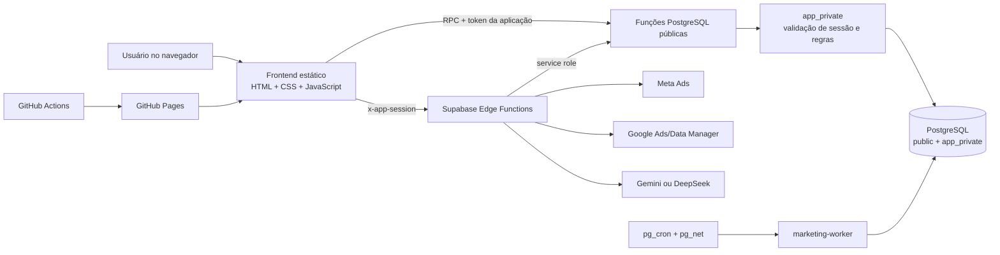
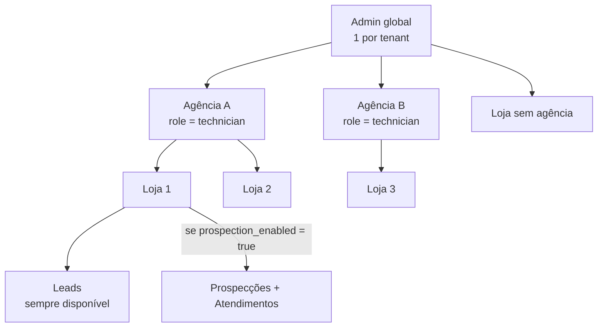
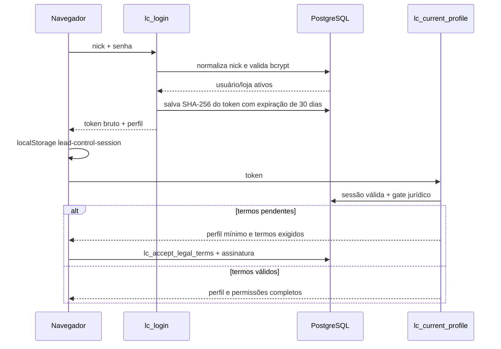
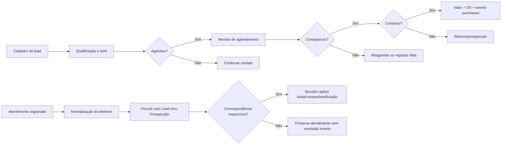
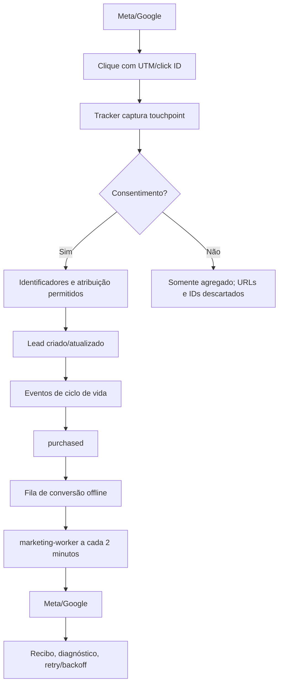

# Controle de Leads — documentação completa do projeto

> Retrato técnico e funcional verificado em **14 de agosto de 2026**.
>
> Este documento descreve o código local e, quando indicado, o estado do projeto Supabase remoto `menlvmsgkhgqxiydphbn`. O banco remoto é a fonte de verdade para produção; os arquivos SQL do repositório também contêm a evolução histórica do produto.

## 1. Resumo executivo

O Controle de Leads é um SaaS B2B para óticas. Ele possui uma interface web única, três módulos operacionais e três níveis de conta:

- **Admin:** proprietário global do ambiente e de todos os dados do tenant.
- **Agência:** perfil gravado no banco como `technician`; administra a própria carteira de clientes.
- **Cliente/loja:** opera somente os dados da sua loja.

Os módulos atuais são:

1. **Leads:** cadastro, acompanhamento, agenda, funil, inteligência comercial, marketing, relatórios e exportações.
2. **Prospecções:** carteira de prospecção, profissionais, metas, bonificação, resultados e análises.
3. **Atendimentos:** registro de atendimentos feitos na loja, vínculo automático por telefone e atualização controlada de resultados.

O módulo **Leads** está disponível para todas as lojas. **Prospecções e Atendimentos formam uma única licença adicional**: `stores.prospection_enabled`. Atendimentos não possui uma licença separada.

Não existe mais ferramenta de WhatsApp. Foram retirados frontend, tabelas, credenciais, workers, webhooks, Edge Functions, limites de plano e agendamentos exclusivos desse módulo. Telefones, origem histórica com texto “WhatsApp” e botão genérico de ligação (`tel:`) não são ferramentas de WhatsApp e podem permanecer como dados comuns.

## 2. Arquitetura geral

O frontend é uma aplicação estática em HTML, CSS e JavaScript puro. Não há framework, bundler, `package.json` ou etapa de compilação. A persistência e as regras críticas ficam no Supabase/PostgreSQL; integrações sensíveis ficam em Edge Functions.



### 2.1 Tecnologias e dependências

| Camada | Tecnologia | Uso |
|---|---|---|
| Interface | HTML5 | Estrutura de todas as telas e modais. |
| Interface | CSS3 | Tema claro/escuro, componentes, módulos e responsividade. |
| Interface | JavaScript ES | Estado, renderização, validações, gráficos próprios, XLSX e chamadas ao backend. |
| Ícones | Font Awesome 6.5.2 via CDN | Ícones visuais da interface. |
| Cliente de dados | `@supabase/supabase-js@2` via CDN | Chamadas RPC ao Supabase. |
| Banco | Supabase PostgreSQL | Dados, permissões, regras, auditoria, filas e cron. |
| Funções | Supabase Edge Functions/Deno | IA, marketing, OAuth e workers. |
| Criptografia SQL | `pgcrypto` | Senhas, tokens, hashes e evidências. |
| Agendamento | `pg_cron` + `pg_net` | Worker de marketing e retenção. |
| Hospedagem web | GitHub Pages | Publicação do site estático. |
| PWA | Web App Manifest | Instalação em tela inicial e identidade visual. |
| Persistência local | `localStorage` e IndexedDB | Sessão, tema, módulo, chats e autorizações de backup. |
| APIs externas | Meta e Google Ads | Métricas e conversões offline. |
| IA externa | Gemini ou DeepSeek | Análises comerciais agregadas. |

### 2.2 Características importantes

- É uma **SPA sem roteador por URL**: as telas são seções alternadas por JavaScript.
- O Supabase Auth **não é usado para login do produto**. Existe autenticação própria em `app_users` e `app_sessions`.
- A chave `anon` do Supabase está no navegador, como esperado para cliente público. A segurança depende de RLS, revogação de acesso direto e validação de sessão dentro das RPCs.
- Não há Service Worker. O app é instalável pelo manifesto, mas **não tem cache offline completo**.
- O fuso operacional padrão é `America/Sao_Paulo`; datas visuais usam `pt-BR`.

## 3. Hierarquia de contas, dados e licenças



### 3.1 Regras de propriedade

- `admin_user_id` identifica o tenant e aparece em praticamente todas as tabelas de negócio.
- `store_id` impede a mistura de informações entre clientes.
- `stores.technician_user_id` vincula uma loja à agência responsável.
- Uma conta `store` também aponta para a loja em `app_users.store_id`.
- O Admin pode acessar qualquer loja do próprio tenant.
- A Agência pode acessar somente lojas em que `technician_user_id` é o seu usuário.
- A Loja pode acessar somente `app_users.store_id`.
- Análises e IA trabalham com **uma loja selecionada por vez**; dados de lojas diferentes não são combinados.

### 3.2 Limites de plano

| Campo | Significado |
|---|---|
| `app_users.store_limit` | Quantidade máxima de clientes que uma agência pode cadastrar. |
| `app_users.prospection_store_limit` | Quantidade máxima de clientes da agência que podem ter Prospecções + Atendimentos. |
| `stores.prospection_enabled` | Liga ou desliga o pacote Prospecções + Atendimentos para a loja. |

Ao reduzir um limite abaixo do uso atual, o sistema preserva as lojas que já estavam ativas. Novas ativações ficam bloqueadas até a agência voltar ao limite; a escolha de quais clientes desativar é administrativa e não automática.

### 3.3 Matriz de permissões

| Recurso | Admin | Agência | Loja |
|---|:---:|:---:|:---:|
| Entrar e alterar tema | Sim | Sim | Sim |
| Ver todos os clientes do tenant | Sim | Não | Não |
| Ver clientes da própria carteira | Sim | Sim | Própria loja |
| Criar/editar/excluir agência | Sim | Não | Não |
| Criar/editar/excluir loja | Sim | Própria carteira | Não |
| Definir limites e licenças | Sim | Não | Não |
| Operar Leads | Sim | Sim | Sim |
| Editar categorias da loja | Sim | Sim | Sim, própria loja |
| Operar Prospecções | Sim | Sim | Sim, se licenciada |
| Operar Atendimentos | Sim | Sim | Sim, se licenciada |
| Ver análises | Sim | Sim, própria carteira | Própria loja |
| Exportar dados | Sim | Sim, própria carteira | Própria loja |
| Configurar backup em HD | Sim | Sim | Não |
| Configurar IA central | Sim | Não | Não |
| Usar IA de análise | Sim | Sim | Não |
| Administrar termos legais | Sim | Não | Não |
| Assinar termos obrigatórios | Sim | Sim | Sim |

## 4. Hierarquia de arquivos

```text
lead-control-/
├── index.html                         # Estrutura da SPA e todos os mounts/modais
├── app.js                             # Núcleo: sessão, Leads, contas, análises, IA, backup
├── styles.css                         # Design system e telas do núcleo
├── mobile.css                         # Responsividade compartilhada
├── marketing.js / marketing.css       # Interface de atribuição e conexões de marketing
├── prospections.js / prospections.css # Módulo de Prospecções
├── prospec-original.css               # Camada visual original ativada pelo módulo
├── attendances.js / attendances.css   # Módulo de Atendimentos
├── manifest.webmanifest               # Manifesto instalável/PWA
├── favicon.ico e logo__.png           # Identidade na raiz
├── assets/                            # Ícones, logo e preview social
│   ├── logo-source.png
│   ├── link-preview.png
│   ├── app-icon-192.png
│   ├── app-icon-512.png
│   ├── maskable-icon-512.png
│   ├── apple-touch-icon.png
│   ├── favicon-16.png
│   ├── favicon-32.png
│   └── site-icon.png
├── database.sql                       # Base consolidada + histórico incremental
├── attendance_module.sql              # Schema e RPCs de Atendimentos
├── marketing_attribution_module.sql   # Atribuição segura atual
├── marketing_scheduler.sql            # Worker por cron/Vault
├── *_update.sql                       # Migrações incrementais históricas
├── *_qa.sql                           # QA SQL transacional
├── remove_whatsapp_module.sql         # Retirada destrutiva do módulo descontinuado
├── MARKETING_ATTRIBUTION_SETUP.md      # Implantação da atribuição atual
├── MARKETING_INTELLIGENCE_SETUP.md     # Fundação de inteligência/IA
├── supabase/
│   ├── config.toml                    # Configuração local das Edge Functions
│   └── functions/
│       ├── ai-analysis/index.ts
│       ├── marketing-api/index.ts
│       ├── marketing-worker/index.ts
│       ├── marketing-conversions/index.ts # Legado; não publicar
│       └── _shared/marketing/          # Cripto, banco, providers, respostas e testes
└── .github/workflows/pages.yml         # Deploy do frontend no GitHub Pages
```

### 4.1 Diretório local legado `prospec/`

`prospec/` é um repositório local aninhado e ignorado pelo Git principal. Ele guarda a versão original independente do sistema de prospecção e SQLs antigos, servindo apenas como referência. O produto publicado usa `prospections.js`, `prospections.css`, `prospec-original.css` e as RPCs atuais do projeto principal.

Arquivos `prospec-backup*.json` também são ignorados e podem conter dados pessoais. Não devem ser commitados.

### 4.2 Ordem de carregamento do navegador

1. `styles.css`
2. `marketing.css`
3. `prospections.css`
4. `attendances.css`
5. `prospec-original.css` inicialmente desabilitado
6. `mobile.css`
7. Font Awesome
8. Supabase JS v2
9. `app.js`
10. `marketing.js`
11. `prospections.js`
12. `attendances.js`

Os módulos expõem pontes globais:

- `window.MarketingAttributionModule`
- `window.ProspectionsModule`
- `window.AttendancesModule`

`app.js` fornece a sessão, lojas, dados e navegação; cada módulo monta sua própria interface no contêiner correspondente.

## 5. Mapa de telas e interface

```text
Aplicação
├── Login
│   ├── Nick
│   ├── Senha
│   └── Aceite legal obrigatório, quando pendente
├── Barra superior
│   ├── Identidade, avatar e perfil
│   ├── Seletor: Leads | Prospecções | Atendimentos
│   ├── Data
│   ├── Alertas de agendamento
│   ├── Administração/configurações, conforme perfil
│   ├── Tema
│   └── Sair
├── Área Admin/Agência
│   ├── Clientes
│   ├── Agências, somente Admin
│   ├── Analytics
│   ├── Backups
│   ├── Central jurídica, somente Admin
│   └── Configuração de IA, somente Admin
├── Área da loja — Leads
│   ├── Resumo e indicadores
│   ├── Monitor de agendamentos atrasados
│   ├── Formulário de lead
│   ├── Pesquisa e filtros
│   ├── Lista/cartões de leads
│   ├── Categorias e opções
│   ├── Marketing e metas
│   └── Exportação
├── Prospecções
│   ├── Operação
│   ├── Atendimentos para prospectar
│   ├── Gestão
│   ├── Análise
│   ├── Bonificação
│   ├── Configurações
│   └── Importação/exportação
├── Atendimentos
│   ├── Formulário
│   ├── Indicadores
│   ├── Filtros
│   └── Histórico
└── Modais
    ├── Detalhe/edição de lead
    ├── Conta, loja e agência
    ├── Confirmação e alterações não salvas
    ├── Agendamento
    ├── Inspetor de analytics
    ├── Chat, histórico e configuração de IA
    ├── Conexão de marketing
    ├── Aceite de termos
    └── Documento jurídico
```

### 5.1 Design system e responsividade

- Paleta base: fundo `#e8e8e8`, superfície `#ffffff`, texto `#171717`, verde `#16855f`, azul `#2563a5`, âmbar `#b46d12` e rosa `#b02f4c`.
- Raio base: `8px`.
- Fonte: pilha de sistema/Inter, sem download obrigatório de uma fonte externa.
- Tema escuro: classes `body.is-dark` e `body.is-dark-mode` atendem partes antigas e novas.
- Breakpoints compartilhados principais: `900px` e `720px`, com ajustes específicos em cada módulo.
- No celular, a intenção atual é preservar a mesma interface e todos os recursos, apenas em uma composição mais densa.
- Controles de formulário usam ao menos `16px` no mobile para evitar zoom automático do iOS.
- `safe-area-inset-*`, `min-width: 0`, quebra de texto e contenção de mídia evitam cortes e rolagem horizontal acidental.

## 6. Sessão, autenticação e termos legais

### 6.1 Fluxo de entrada



### 6.2 Detalhes de segurança da sessão

- O nick é normalizado em minúsculas, com espaços convertidos em hífen.
- Senhas são armazenadas com bcrypt por `crypt(..., gen_salt('bf'))`.
- O token bruto aleatório é entregue somente ao navegador.
- `app_sessions.token_hash` guarda SHA-256, não o token bruto.
- A sessão expira em 30 dias e pode ser revogada no logout.
- `app_private.session_user` valida token, expiração, revogação, usuário ativo, loja ativa e atualiza `last_seen_at`.
- A sessão local fica em `localStorage` sob `lead-control-session`.
- Toda RPC de negócio revalida a sessão; esconder um botão não é considerado autorização.

### 6.3 Gate jurídico

Quando há termos ativos não aceitos, apenas o carregamento mínimo do perfil e as operações jurídicas continuam disponíveis. O restante das RPCs é bloqueado até o aceite.

O aceite registra:

- versão, título, conteúdo e hash do documento;
- conta, tenant e snapshots de agência/loja;
- nome e cargo do signatário;
- CPF em hash e somente os quatro últimos dígitos visíveis;
- assinatura em PNG/data URL e hash próprio;
- confirmações explícitas;
- IP, User-Agent, timezone e horário do cliente;
- `evidence_hash`, vinculando documento, pessoa, assinatura e contexto.

O Admin pode consultar pendências, aceites válidos/desatualizados e baixar um comprovante HTML imprimível.

## 7. Fluxos ponta a ponta

### 7.1 Criação da estrutura B2B

1. O Admin global é provisionado diretamente no banco; não existe RPC pública para criar outro Admin.
2. O Admin cria uma Agência, informando nome, nick, senha, limite de clientes e limite de licenças Prospecções.
3. Admin ou Agência cria uma loja dentro do escopo permitido.
4. A loja recebe conta de login e sempre tem Leads.
5. O Admin pode ativar `prospection_enabled`, respeitando a franquia da Agência.
6. Quando a licença é ativada, Prospecções e Atendimentos tornam-se acessíveis juntos.

### 7.2 Lead até atendimento e compra



### 7.3 Marketing até conversão offline



## 8. Módulo Leads

### 8.1 Cadastro e edição

Campos principais:

- nome e telefone;
- data do contato;
- canal, campanha, início da conversa e conclusão;
- situação do ciclo de vida: `new`, `contacted`, `qualified`, `scheduled`, `visited`, `won` ou `lost`;
- responsável e qualificação;
- agendou, data e horário;
- visitou;
- comprou, valor da compra e ordem de serviço;
- observações;
- categorias personalizadas da loja;
- inteligência: e-mail, motivo de perda, timestamps do funil, UTM, IDs de clique/anúncio, landing page, consentimento e cliente recorrente.

Regras principais:

- Agendamento “Sim” exige data; o horário é opcional.
- Visita “Sim” exige uma resposta de compra.
- Compra “Sim” exige valor maior que zero e ordem de serviço.
- O salvamento preferencial usa `lc_upsert_lead_with_intelligence`, mantendo lead, valores personalizados e inteligência na mesma operação.
- Existe fallback compatível com `lc_upsert_lead` seguido de `lc_save_lead_intelligence`.

### 8.2 Categorias e opções

Grupos padrão por loja:

- Canal: Instagram, Facebook e Ligação.
- Campanha: Orgânico, Anúncio e Indicação.
- Início da conversa: preço, consulta, armação e lente.
- Conclusão: Aguardando, Retornar e Finalizado.
- Visitou, Comprou e Agendou: opções fixas Sim/Não.

É possível renomear rótulos dos grupos, criar categorias personalizadas, adicionar/editar/excluir opções e mudar a ordem. Opções fixas de Sim/Não não podem ser adulteradas.

A opção WhatsApp foi desativada como sugestão para novos cadastros. Valores históricos já salvos não são apagados.

### 8.3 Agenda

O monitor considera pendentes os leads com:

- `scheduled = 'Sim'`;
- data anterior ao dia atual;
- `visited != 'Sim'`.

As ações permitem ligar pelo discador do aparelho, marcar comparecimento, registrar que não veio/reagendar ou abrir a edição completa.

### 8.4 Analytics

Cada painel usa exatamente uma loja. Filtros disponíveis incluem período, canal, campanha, conclusão, ciclo de vida, qualificação, visita, agendamento, compra e categorias personalizadas.

Indicadores e visualizações incluem:

- volume de leads, qualificados, agendados, visitas e vendas;
- conversões entre etapas;
- receita, ticket médio e taxa de comparecimento;
- rankings por canal/campanha/opção;
- gráficos de pizza, barras e linha;
- comparação com período anterior;
- inspetor de registros por fatia;
- qualidade dos dados;
- CPL, CAC e ROAS quando investimento/metas estão disponíveis.

### 8.5 Exportação

O projeto contém um gerador XLSX próprio, sem biblioteca externa. A exportação cria as planilhas **Leads** e **Resumo**. Células iniciadas por `=`, `+`, `-` ou `@` recebem proteção contra injeção de fórmula.

- Loja: exporta seus dados por período/filtro.
- Agência/Admin: escolhe cliente e escopo permitido.
- A exportação manual é `.xlsx` real.

## 9. Backups em HD

Disponível para Admin e Agência, principalmente em Chrome/Edge desktop por depender de `showDirectoryPicker` e IndexedDB.

### 9.1 Fluxo

1. Usuário escolhe uma pasta/HD e concede leitura/escrita.
2. O identificador da pasta e manifestos são guardados no IndexedDB `lead-control-backup`.
3. O sistema verifica a cada minuto.
4. Depois das 20h, com o app aberto e permissão válida, atualiza os dados remotos.
5. Por loja, calcula um fingerprint do snapshot: SHA-256 quando disponível, FNV como fallback.
6. O primeiro arquivo é completo; os seguintes carregam apenas registros novos ou alterados.

Estrutura de diretórios:

```text
Controle de Leads/
└── <Admin ou Agência>/
    └── <Loja (@login)>/
        └── <ano>/
            └── <MM - mês>/
                └── Semana NN/
                    ├── backup-completo-....xls
                    └── backup-incremental-....xls
```

Os backups automáticos `.xls` são workbooks HTML compatíveis com Excel; não são o mesmo formato da exportação manual `.xlsx`.

Limitações:

- o navegador e o sistema precisam estar abertos após 20h;
- o HD precisa estar conectado e com permissão;
- Safari, Firefox e celulares normalmente não oferecem a API necessária;
- remoções de registros não geram um “tombstone” explícito no incremental; o próximo manifesto apenas deixa de conter o ID.

## 10. Módulo Prospecções

### 10.1 Acesso

- Admin: escolhe agência/cliente e acompanha a carteira completa.
- Agência: acessa apenas clientes da própria carteira.
- Loja licenciada: opera sua própria prospecção.
- Loja sem licença: recebe tela de upgrade/leitura e pode exportar o arquivo antes de uma desativação.

### 10.2 Operação

Uma prospecção possui nome, telefone, CPF, observação, profissional, etiquetas e probabilidade:

- vermelho: Improvável;
- amarelo: Pouco provável;
- azul: Provável;
- verde: Muito provável.

A busca percorre nome, telefone, CPF e observação. Os estados principais são aberto, retornou e comprou. Ações: ligar, editar, marcar retorno, registrar/remover compra e excluir.

Uma compra registra valor e OS. O histórico mantém snapshots do profissional para que mudanças futuras de nome/arquivamento não alterem o passado.

### 10.3 Atendimentos para prospectar

O módulo consulta atendimentos por loja, tipo, período e texto. Ao selecionar um atendimento:

- se houver prospecção inequívoca, abre o cadastro existente;
- se não houver, preenche uma nova prospecção;
- se houver ambiguidade, evita escolher silenciosamente a pessoa errada.

### 10.4 Gestão, análise e bonificação

- Indicadores: total, retornos/visitas, compras, conversão, bônus e meta diária.
- Períodos rápidos: hoje, semana, mês, ano e todo o período.
- Gestão: cartões, rankings e tendências.
- Análise: diária, semanal, mensal, anual ou personalizada; desempenho por profissional e campanha; linhas e calendário.
- Bônus: agrupa atividade, retorno, compras, receita e prêmio por profissional, com rastreabilidade pela OS.

Configuração inicial:

- meta diária: `15`;
- compra mínima para bônus: `300`;
- valor do bônus: `20`;
- cor de destaque: `#16855f`;
- fundo do logo: branco.

A configuração completa é salva atomicamente e possui controle de revisão para impedir que duas telas sobrescrevam alterações concorrentes. Profissionais podem ser inativados ou arquivados; o histórico permanece.

### 10.5 Importação e retenção

- Importa backup JSON de até 10 MB.
- Primeiro executa somente validação/preview.
- Exige confirmação explícita da loja de destino.
- Usa hash do payload e lote idempotente para impedir duplicação em replay.
- Importa prospecções, resultados, profissionais, etiquetas e configurações sem trocar identidade, login, logo, permissões ou dados já existentes da loja.
- Os registros operacionais têm retenção móvel de dois anos; listagem, exportação e gatilhos aplicam a janela mesmo sem cron dedicado.

## 11. Módulo Atendimentos

### 11.1 Formulário

Obrigatórios:

- profissional cadastrado;
- nome do cliente;
- telefone brasileiro com DDD;
- descrição;
- tipo: orçamento, compra ou outro.

O valor de atendimento é opcional. Em uma compra, valor da compra e OS são obrigatórios.

### 11.2 Vínculo automático e segurança

O servidor normaliza o telefone e procura, dentro da mesma loja, Leads e Prospecções correspondentes. Ele pode vincular os dois cadastros.

- Correspondência única: pode aplicar visita, compra e crédito de bônus.
- Mais de uma correspondência: preserva o atendimento, registra candidatos/ambiguidade e não altera resultados financeiros incertos.
- Sem correspondência: o atendimento continua válido e independente.

O servidor, não o frontend, decide elegibilidade, valor e profissional creditado. Os valores de configuração e os nomes são salvos como snapshots.

`idempotency_key` e `request_fingerprint` impedem que duplo clique, retry ou reconexão criem o mesmo atendimento duas vezes.

### 11.3 Painel

Filtros: texto, tipo, profissional e período (hoje, 7 dias, 30 dias ou todo o período). Indicadores: total, orçamentos, compras, conversão, receita e valores de atendimento. A lista mostra origem e vínculos.

Retenção: dois anos. O cron remoto `lc_attendance_retention_daily` executa diariamente às **03:17**; o upsert também possui fallback de limpeza.

## 12. Marketing e atribuição

### 12.1 Duas gerações coexistentes

**Fundação legada ainda usada parcialmente:**

- `lead_intelligence` e `lead_events`;
- métricas manuais em `ad_daily_metrics`;
- metas em `store_marketing_targets`;
- `marketing_connections` e `marketing_conversion_queue`, mantidas por compatibilidade.

**Atribuição segura atual:**

- conectores em `marketing_attribution_connections`;
- segredos criptografados em `app_private.marketing_attribution_connection_secrets`;
- fontes, touchpoints e eventos de atribuição;
- métricas importadas, filas, execuções, conversões offline e logs;
- OAuth Google com estado de uso único.

`marketing-conversions` é uma Edge Function legada. O código local existe por compatibilidade histórica, mas ela não deve ser publicada. O fluxo atual usa `marketing-api` e `marketing-worker`.

### 12.2 Provedores e credenciais

**Meta:** conta de anúncios, dataset/pixel, access token, versão da API e código de teste opcional.

**Google:** Customer ID, MCC Login ID, Conversion Action, Developer Token, OAuth Client ID/Secret e Refresh Token.

Credenciais da atribuição atual são criptografadas no servidor com `MARKETING_CREDENTIALS_KEY` e nunca retornam ao navegador. Trocar essa chave sem migração torna os segredos antigos ilegíveis.

### 12.3 Consentimento e tracker

- Consentimento local: `lc_marketing_consent=granted`.
- Evento de liberação: `lc:marketing-consent-granted`.
- Com consentimento: UTM, click IDs, anonymous/session ID e jornada podem ser vinculados.
- Sem consentimento: o backend retém somente informação agregada e remove IDs, URLs, UTM, IP e User-Agent.
- IP e User-Agent autorizados são armazenados em hash, não em texto puro.
- Cada fonte possui token próprio e lista de origens permitidas.

### 12.4 Sincronização e conversões

- Primeira sincronização: 90 dias.
- Sincronizações seguintes: janela de 7 dias a cada 6 horas.
- Manual: até 730 dias, divididos em lotes de no máximo 400 dias.
- Worker remoto: a cada 2 minutos.
- Falhas: lease, retries, backoff e cooldown.
- Google: diagnóstico de recibo assíncrono por até 24 horas.
- Evento `purchased`: enfileira conversão para cada conector ativo.
- PII enviada a provedores é normalizada e SHA-256 somente quando existe consentimento.

Retenção:

- touchpoints, eventos, métricas e filas finalizadas: 730 dias;
- logs: 365 dias;
- estado OAuth: 10 minutos e uso único.

### 12.5 Ações da `marketing-api`

| Ação | Finalidade |
|---|---|
| `get-dashboard` | Funil e métricas atribuídas da loja. |
| `list-connections` | Lista conectores sem expor segredos. |
| `save-connection` | Cria/atualiza conector e segredo criptografado. |
| `test-connection` | Testa permissões e IDs no provedor. |
| `disconnect-connection` | Desativa e retira segredo. |
| `sync-now` | Agenda sincronização manual. |
| `get-tracker-config` | Retorna configuração pública do tracker. |
| `rotate-tracker-token` | Troca token de captura. |
| `list-sync-runs` | Auditoria das sincronizações. |
| `list-journey` | Jornada atribuída de um lead. |
| `record-event` | Registra evento do funil. |
| `start-google-oauth` | Inicia OAuth Google. |
| `capture-touchpoint` | Endpoint público autenticado pelo token da fonte. |

## 13. Inteligência artificial

### 13.1 Configuração

Somente o Admin altera a configuração central do tenant. Agência pode usar a IA, mas não visualizar a chave. Loja não tem acesso.

Provedores suportados:

- DeepSeek, modelo `deepseek-chat`;
- Gemini, com modelos oferecidos pela interface, como `gemini-3.5-flash`, `gemini-3.1-flash-lite` e `gemini-3.1-pro-preview`.

`lc_get_ai_settings` devolve `api_key` vazio e apenas `has_api_key`. A chave real é lida pela Edge Function via RPC restrita a `service_role`.

### 13.2 Privacidade e limites

- Cada conversa recebe o recorte de uma única loja.
- O contexto enviado é agregado/anonimizado: não inclui nome, telefone, observações nem OS.
- Até 24 mensagens por requisição.
- Até 6.000 caracteres por mensagem.
- Até 42.000 caracteres no histórico enviado.
- Até 90.000 caracteres de contexto JSON.
- Temperatura `0.25`.
- Amostras menores que 30 registros devem ser sinalizadas como pequenas.
- Rate limit atual: 120 análises por hora por tenant/Admin.
- Uso registra provedor, modelo, tipo, tokens estimados, latência e status.

O streaming é repassado como SSE. A interface permite parar, editar, copiar e excluir mensagens. O histórico fica apenas no navegador em `lead-control-ai-chats`, separado por conta e loja, com até 40 conversas.

## 14. Persistência local do navegador

| Chave/banco | Conteúdo |
|---|---|
| `lead-control-session` | Token bruto e perfil restaurável. |
| `lead-control-theme` | Tema claro ou escuro. |
| `lead-control-module:<profile id>` | Último módulo aberto pelo perfil. |
| `lead-control-ai-chats` | Chats locais de IA, por conta e loja. |
| IndexedDB `lead-control-backup` | Handles de pasta e manifestos de backup. |

Limpar dados do site encerra a restauração local, remove chats e exige escolher novamente o HD. A sessão ainda pode permanecer válida no servidor até expirar/revogar, mas o navegador perde o token.

## 15. Banco de dados — visão estrutural

### 15.1 Schemas

- `public`: tabelas de domínio e wrappers RPC chamados pelo browser/Edge Functions.
- `app_private`: validação de sessão, segredos e helpers internos.
- `extensions`: extensões Postgres usadas com `search_path` explícito.

No estado remoto verificado existem **35 tabelas públicas e 3 privadas** relacionadas abaixo. `!` significa `NOT NULL`; `?` significa anulável.

### 15.2 Tabelas de identidade, contas e jurídico

| Tabela | Colunas atuais |
|---|---|
| `app_users` | `id uuid!`, `nick text!`, `nick_key text!`, `password_hash text!`, `full_name text!`, `role app_user_role!`, `admin_user_id uuid?`, `store_id uuid?`, `is_active bool!`, `last_login_at timestamptz?`, `created_at!`, `updated_at!`, `store_limit int!`, `avatar_url text?`, `prospection_store_limit int!` |
| `app_sessions` | `id uuid!`, `user_id uuid!`, `token_hash text!`, `expires_at!`, `revoked_at?`, `last_seen_at?`, `created_at!` |
| `stores` | `id uuid!`, `admin_user_id uuid!`, `name text!`, `nick text!`, `nick_key text!`, `is_active bool!`, `created_at!`, `updated_at!`, `technician_user_id uuid?`, `avatar_url text?`, `prospection_enabled bool!` |
| `system_legal_terms` | `id uuid!`, `version text!`, `title text!`, `content text!`, `content_hash text!`, `effective_at!`, `is_active bool!`, `created_at!` |
| `legal_term_acceptances` | `id uuid!`, `terms_id uuid!`, `terms_version!`, `terms_title!`, `terms_snapshot!`, `terms_hash!`, `admin_user_id uuid!`, `accepting_user_id uuid?`, `account_role!`, `account_name_snapshot!`, `agency_name_snapshot?`, `store_name_snapshot?`, `signer_name!`, `signer_role!`, `signer_cpf_hash!`, `signer_cpf_last4!`, `signature_data_url!`, `signature_hash!`, `confirmations jsonb!`, `ip_address?`, `user_agent?`, `client_timezone?`, `client_timestamp?`, `accepted_at!`, `evidence_hash!` |

Existe índice único parcial que limita o ambiente a um único usuário global com papel Admin.

### 15.3 Leads e configuração

| Tabela | Colunas atuais |
|---|---|
| `leads` | `id uuid!`, `admin_user_id uuid!`, `store_id uuid!`, `name!`, `phone!`, `channel?`, `campaign?`, `conversation_start?`, `conclusion?`, `visited?`, `bought?`, `created_by uuid?`, `updated_by uuid?`, `created_at!`, `updated_at!`, `purchase_amount numeric?`, `service_order?`, `notes?`, `inspected bool!`, `scheduled?`, `scheduled_visit_date date?`, `scheduled_visit_time time?`, `contact_date date!` |
| `lead_intelligence` | `lead_id uuid!`, `admin_user_id uuid!`, `store_id uuid!`, `lifecycle_status!`, `qualified bool!`, `loss_reason?`, `owner_name?`, `email?`, `first_response_at?`, `qualified_at?`, `lost_at?`, `purchased_at?`, `utm_source?`, `utm_medium?`, `utm_campaign?`, `utm_content?`, `utm_term?`, `campaign_external_id?`, `adset_external_id?`, `ad_external_id?`, `creative_external_id?`, `gclid?`, `gbraid?`, `wbraid?`, `fbclid?`, `fbc?`, `fbp?`, `landing_page_url?`, `external_lead_id?`, `marketing_consent bool!`, `consent_at?`, `returning_customer bool!`, `created_at!`, `updated_at!` |
| `lead_events` | `id uuid!`, `admin_user_id uuid!`, `store_id uuid!`, `lead_id uuid!`, `event_type!`, `event_at!`, `actor_user_id uuid?`, `source!`, `metadata jsonb!`, `created_at!` |
| `lead_options` | `id uuid!`, `admin_user_id uuid!`, `group_key!`, `value!`, `sort_order int!`, `fixed bool!`, `is_active bool!`, `created_at!`, `updated_at!`, `store_id uuid?` |
| `lead_custom_categories` | `id uuid!`, `admin_user_id uuid!`, `name!`, `sort_order int!`, `is_active bool!`, `created_at!`, `updated_at!`, `store_id uuid?` |
| `lead_custom_options` | `id uuid!`, `admin_user_id uuid!`, `category_id uuid!`, `value!`, `sort_order int!`, `is_active bool!`, `created_at!`, `updated_at!` |
| `lead_custom_values` | `lead_id uuid!`, `admin_user_id uuid!`, `category_id uuid!`, `value!`, `created_at!`, `updated_at!` |
| `store_configuration_labels` | `store_id uuid!`, `admin_user_id uuid!`, `group_key!`, `label!`, `created_at!`, `updated_at!` |

### 15.4 Prospecções e Atendimentos

| Tabela | Colunas atuais |
|---|---|
| `prospections` | `id uuid!`, `admin_user_id uuid!`, `store_id uuid!`, `name!`, `phone?`, `cpf?`, `notes?`, `probability!`, `tags text[]!`, `professional_id uuid?`, `professional_name_snapshot?`, `returned_at?`, `purchased_at?`, `purchase_amount?`, `purchase_order?`, `created_by?`, `updated_by?`, `created_at!`, `updated_at!`, `import_source?`, `import_source_store_id?`, `import_source_id?`, `import_source_updated_at?`, `import_batch_id?`, `imported_at?` |
| `prospection_professionals` | `id uuid!`, `store_id uuid!`, `admin_user_id uuid!`, `name!`, `is_active bool!`, `created_at!`, `updated_at!`, `archived_at?`, `archived_by?` |
| `prospection_store_settings` | `store_id uuid!`, `admin_user_id uuid!`, `daily_goal int!`, `bonus_minimum numeric!`, `bonus_amount numeric!`, `accent_color!`, `created_at!`, `updated_at!`, `logo_background_color!` |
| `prospection_tag_categories` | `id uuid!`, `store_id uuid!`, `admin_user_id uuid!`, `name!`, `sort_order int!`, `created_at!`, `updated_at!` |
| `prospection_tags` | `id uuid!`, `store_id uuid!`, `admin_user_id uuid!`, `label!`, `created_at!`, `updated_at!`, `category_id uuid!`, `sort_order int!` |
| `prospection_import_batches` | `id uuid!`, `admin_user_id uuid!`, `store_id uuid!`, `imported_by?`, `source_format!`, `schema_version!`, `source_store_id!`, `payload_sha256!`, `exported_at?`, `summary jsonb!`, `created_at!` |
| `attendances` | `id uuid!`, `admin_user_id uuid!`, `store_id uuid!`, `professional_id?`, `professional_name_snapshot!`, `credited_professional_id?`, `credited_professional_name_snapshot?`, `prospection_professional_id?`, `prospection_professional_name_snapshot?`, `bonus_minimum_snapshot!`, `bonus_amount_snapshot!`, `bonus_eligible!`, `bonus_awarded_amount!`, `bonus_credit_status!`, `customer_name!`, `phone!`, `phone_normalized!`, `description!`, `tag!`, `service_value?`, `purchase_value?`, `service_order?`, `lead_id?`, `prospection_id?`, `match_status!`, `lead_match_count!`, `prospection_match_count!`, `match_ambiguous!`, `lead_candidates jsonb!`, `prospection_candidates jsonb!`, `lead_visit_applied!`, `lead_purchase_applied!`, `prospection_visit_applied!`, `prospection_purchase_applied!`, `purchase_credit_applied!`, `attended_at!`, `outcome_applied_at?`, `idempotency_key!`, `request_fingerprint!`, `metadata jsonb!`, `created_by?`, `created_at!`, `updated_at!` |

### 15.5 IA, metas e marketing legado

| Tabela | Colunas atuais |
|---|---|
| `ai_settings` | `admin_user_id uuid!`, `provider!`, `model!`, `api_key!`, `system_prompt!`, `updated_by_user_id?`, `created_at!`, `updated_at!` |
| `ai_usage` | `id uuid!`, `admin_user_id uuid!`, `user_id?`, `store_id?`, `provider!`, `model!`, `request_kind!`, `input_tokens?`, `output_tokens?`, `latency_ms?`, `status!`, `created_at!` |
| `ad_daily_metrics` | `id uuid!`, `admin_user_id uuid!`, `store_id uuid!`, `metric_date date!`, `platform!`, `account_external_id!`, `campaign_external_id!`, `campaign_name!`, `adset_external_id!`, `adset_name!`, `ad_external_id!`, `ad_name!`, `creative_external_id!`, `spend!`, `impressions!`, `reach!`, `clicks!`, `platform_leads!`, `platform_conversions!`, `currency!`, `source!`, `raw_metrics jsonb!`, `created_at!`, `updated_at!` |
| `store_marketing_targets` | `store_id uuid!`, `admin_user_id uuid!`, `monthly_budget?`, `lead_goal?`, `qualified_goal?`, `sales_goal?`, `revenue_goal?`, `target_cpl?`, `target_cac?`, `target_roas?`, `created_at!`, `updated_at!` |
| `marketing_connections` | `id uuid!`, `admin_user_id uuid!`, `store_id uuid!`, `provider!`, `status!`, `account_external_id?`, `account_name?`, `public_config jsonb!`, `secret_config jsonb!`, `last_sync_at?`, `last_error?`, `created_at!`, `updated_at!` |
| `marketing_conversion_queue` | `id uuid!`, `admin_user_id uuid!`, `store_id uuid!`, `lead_id uuid!`, `provider!`, `event_name!`, `event_at!`, `payload jsonb!`, `status!`, `attempt_count!`, `next_attempt_at!`, `processed_at?`, `last_error?`, `created_at!`, `updated_at!` |

As duas últimas tabelas são da integração de marketing antiga, não do módulo descontinuado de WhatsApp.

### 15.6 Atribuição de marketing atual

| Tabela | Colunas atuais |
|---|---|
| `marketing_attribution_connections` | `id uuid!`, `admin_user_id uuid!`, `store_id uuid!`, `provider!`, `name!`, `status!`, `account_external_id!`, `account_name?`, `api_version!`, `token_expires_at?`, `public_config jsonb!`, `last_validated_at?`, `last_sync_at?`, `last_error_code?`, `last_error_message?`, `created_by?`, `updated_by?`, `created_at!`, `updated_at!` |
| `marketing_tracking_sources` | `id uuid!`, `admin_user_id uuid!`, `store_id uuid!`, `name!`, `token_hash!`, `token_prefix!`, `allowed_origins text[]!`, `is_active!`, `last_used_at?`, `created_by?`, `created_at!`, `updated_at!` |
| `marketing_touchpoints` | `id uuid!`, `admin_user_id uuid!`, `store_id uuid!`, `tracking_source_id?`, `lead_id?`, `anonymous_id?`, `session_id?`, `event_name!`, `occurred_at!`, `provider?`, `utm_source?`, `utm_medium?`, `utm_campaign?`, `utm_content?`, `utm_term?`, `campaign_external_id?`, `adset_external_id?`, `ad_external_id?`, `creative_external_id?`, `gclid?`, `gbraid?`, `wbraid?`, `fbclid?`, `fbc?`, `fbp?`, `landing_page_url?`, `referrer_url?`, `marketing_consent!`, `consent_at?`, `consent_version?`, `consent_source?`, `ip_hash?`, `user_agent_hash?`, `idempotency_key!`, `metadata jsonb!`, `created_at!` |
| `marketing_attribution_events` | `id uuid!`, `admin_user_id uuid!`, `store_id uuid!`, `lead_id uuid!`, `event_type!`, `event_at!`, `value?`, `currency!`, `actor_user_id?`, `source!`, `idempotency_key!`, `metadata jsonb!`, `created_at!` |
| `marketing_ad_metrics` | `id uuid!`, `admin_user_id uuid!`, `store_id uuid!`, `connection_id uuid!`, `metric_date date!`, `provider text!`, `account_external_id text!`, `campaign_external_id text!`, `campaign_name text!`, `adset_external_id text!`, `adset_name text!`, `ad_external_id text!`, `ad_name text!`, `creative_external_id text!`, `spend numeric!`, `impressions int8!`, `reach int8!`, `clicks int8!`, `platform_leads int8!`, `platform_conversions int8!`, `conversion_value numeric!`, `currency text!`, `raw_metrics jsonb!`, `sync_run_id uuid?`, `synced_at timestamptz!`, `created_at!`, `updated_at!` |
| `marketing_sync_queue` | `id uuid!`, `admin_user_id uuid!`, `store_id uuid!`, `connection_id uuid!`, `provider text!`, `start_date date!`, `end_date date!`, `status text!`, `priority int!`, `attempt_count int!`, `max_attempts int!`, `available_at timestamptz!`, `locked_at timestamptz?`, `locked_by text?`, `completed_at timestamptz?`, `last_error_code text?`, `last_error_message text?`, `requested_by uuid?`, `created_at!`, `updated_at!` |
| `marketing_sync_runs` | `id uuid!`, `admin_user_id uuid!`, `store_id uuid!`, `connection_id uuid!`, `queue_id uuid?`, `provider text!`, `start_date date!`, `end_date date!`, `status text!`, `rows_received int!`, `rows_upserted int!`, `started_at timestamptz!`, `finished_at timestamptz?`, `error_code text?`, `error_message text?`, `provider_metadata jsonb!`, `created_at!` |
| `marketing_offline_conversion_queue` | `id uuid!`, `admin_user_id uuid!`, `store_id uuid!`, `connection_id uuid!`, `lead_id uuid!`, `provider text!`, `event_name text!`, `event_at timestamptz!`, `event_id text!`, `payload jsonb!`, `status text!`, `attempt_count int!`, `max_attempts int!`, `available_at timestamptz!`, `locked_at timestamptz?`, `locked_by text?`, `sent_at timestamptz?`, `diagnostic_attempt_count int!`, `next_diagnostic_at timestamptz?`, `confirmed_at timestamptz?`, `provider_receipt jsonb?`, `last_error_code text?`, `last_error_message text?`, `created_at!`, `updated_at!` |
| `marketing_attribution_logs` | `id int8!`, `admin_user_id uuid?`, `store_id uuid?`, `connection_id uuid?`, `user_id uuid?`, `level text!`, `category text!`, `action text!`, `success bool!`, `correlation_id text?`, `latency_ms int?`, `http_status int?`, `error_code text?`, `message text!`, `metadata jsonb!`, `created_at!` |

### 15.7 Tabelas privadas

| Tabela | Colunas atuais |
|---|---|
| `app_private.marketing_attribution_connection_secrets` | `connection_id uuid!`, `secret_cipher bytea!`, `secret_version int!`, `rotated_at!` |
| `app_private.marketing_oauth_states` | `state_hash!`, `admin_user_id!`, `user_id!`, `store_id!`, `connection_id!`, `provider!`, `redirect_after!`, `expires_at!`, `consumed_at?`, `created_at!` |
| `app_private.marketing_maintenance_state` | `task_key!`, `last_run_at?`, `metadata jsonb!` |

## 16. Catálogo de RPCs

As funções `public.lc_*` são contratos usados pelo frontend. Em geral elas encaminham para `app_private.rpc_*`, que valida sessão, tenant, loja e papel. `anon` poder executar um wrapper não significa acesso aberto: o token da aplicação e as regras internas continuam obrigatórios.

### 16.1 Autenticação, contas e planos

- `lc_login`, `lc_current_profile`, `lc_logout`
- `lc_account_usage`
- `lc_create_store`
- `lc_create_technician` — contrato legado
- `lc_create_technician_with_feature_plan`
- `lc_update_admin_credentials`
- `lc_update_store_account` — contrato legado
- `lc_update_store_with_feature_access`
- `lc_update_technician_account` — contrato legado
- `lc_update_technician_with_feature_plan`
- `lc_delete_agency_account`, `lc_delete_store_account`
- `lc_list_stores`, `lc_list_technicians`
- `lc_list_profile_avatars`, `lc_set_profile_avatar`
- `lc_get_prospection_entitlements`
- `lc_set_store_prospection_access`
- `lc_set_technician_prospection_limit`

### 16.2 Jurídico

- `lc_get_required_legal_terms`
- `lc_accept_legal_terms`
- `lc_list_legal_acceptances`
- `lc_get_legal_acceptance_document`

### 16.3 Leads, inteligência e configuração

- `lc_list_leads`, `lc_upsert_lead`, `lc_upsert_lead_with_intelligence`, `lc_delete_lead`, `lc_set_lead_inspected`
- `lc_list_lead_intelligence`, `lc_save_lead_intelligence`
- `lc_list_options`, `lc_add_option`, `lc_update_option`, `lc_delete_option`, `lc_reorder_options`
- `lc_list_custom_categories`, `lc_add_custom_category`, `lc_update_custom_category`, `lc_delete_custom_category`, `lc_reorder_custom_categories`
- `lc_add_custom_option`, `lc_update_custom_option`, `lc_delete_custom_option`, `lc_reorder_custom_options`
- `lc_list_configuration_labels`, `lc_update_configuration_label`

### 16.4 Prospecções

- `lc_get_prospection_configuration`, `lc_list_prospections`, `lc_export_prospections`
- `lc_upsert_prospection`, `lc_delete_prospection`, `lc_set_prospection_outcome`
- `lc_save_prospection_configuration`, `lc_save_prospection_store_settings`, `lc_save_prospection_logo_background`
- `lc_upsert_prospection_category`, `lc_delete_prospection_category`, `lc_reorder_prospection_categories`
- `lc_add_prospection_tag`, `lc_update_prospection_tag`, `lc_delete_prospection_tag`, `lc_reorder_prospection_tags`
- `lc_upsert_prospection_professional`
- `lc_import_prospec_backup`

### 16.5 Atendimentos

- `lc_get_attendance_workspace`
- `lc_list_attendances`
- `lc_upsert_attendance`

### 16.6 Marketing e IA da fundação

- `lc_list_ad_daily_metrics`, `lc_upsert_ad_daily_metric`
- `lc_list_marketing_targets`, `lc_save_marketing_targets`
- `lc_list_marketing_connections`
- `lc_get_ai_settings`, `lc_save_ai_settings`
- Restritas a serviço: `lc_ai_runtime_config`, `lc_log_ai_usage`, `lc_marketing_connection_runtime`

### 16.7 Atribuição atual (`ma_*`)

Chamadas com sessão:

- `ma_get_dashboard`, `ma_list_connections`, `ma_disconnect_connection`
- `ma_schedule_sync`, `ma_get_tracker_config`, `ma_rotate_tracker_token`
- `ma_list_sync_runs`, `ma_list_journey`, `ma_record_event`

Chamadas de serviço:

- `ma_service_save_connection`, `ma_service_connection_runtime`, `ma_service_connection_runtime_by_id`
- `ma_service_update_connection_secrets`, `ma_service_set_connection_status`
- `ma_service_create_oauth_state`, `ma_service_consume_oauth_state`
- `ma_service_capture_touchpoint`
- `ma_service_schedule_due_syncs`, `ma_service_claim_sync`, `ma_service_upsert_metrics`, `ma_service_finish_sync`
- `ma_service_claim_conversions`, `ma_service_finish_conversion`
- `ma_service_claim_conversion_diagnostics`, `ma_service_finish_conversion_diagnostic`
- `ma_service_log`, `ma_service_log_session`, `ma_service_run_retention`

### 16.8 Contratos críticos resumidos

| RPC | Entradas principais | Efeito |
|---|---|---|
| `lc_login` | nick, senha | Autentica e cria token de 30 dias. |
| `lc_update_store_with_feature_access` | sessão, loja, nome, nick, senha opcional, agência, `prospection_enabled` | Atualiza conta, vínculo e licença atomicamente. |
| `lc_create_technician_with_feature_plan` | sessão, nome, nick, senha, limite de lojas, limite Prospecções | Cria agência com franquias. |
| `lc_upsert_lead_with_intelligence` | sessão, loja, campos do lead, custom values, ID opcional, data de contato, intelligence JSON | Salva o cadastro completo e eventos. |
| `lc_save_prospection_configuration` | sessão, loja, snapshot/revisão de configuração | Salva profissionais, categorias, tags e parâmetros atomicamente. |
| `lc_upsert_prospection` | sessão, loja, cadastro, profissional, probabilidade e tags | Cria/edita prospecção. |
| `lc_set_prospection_outcome` | sessão, prospecção, retorno/compra/valor/OS | Atualiza resultado com rastreabilidade. |
| `lc_upsert_attendance` | sessão, loja, profissional, cliente, telefone, descrição, tipo, valores, OS, idempotência | Registra, vincula e aplica resultados seguros. |
| `ma_schedule_sync` | sessão, loja, período | Divide e agenda sincronizações dos conectores ativos. |

### 16.9 Automações internas por trigger

Estas funções não são endpoints normais da interface; são acionadas pelo banco para manter a atribuição consistente:

- `ma_capture_lead_intelligence`: incorpora identificadores autorizados no cadastro de inteligência do lead.
- `ma_capture_lead_lifecycle`: transforma mudanças do funil em eventos de atribuição.
- `ma_enqueue_event_conversions`: cria conversões offline para os conectores ativos.
- `ma_leads_capture_lifecycle`: trigger que observa alterações relevantes em `leads`.
- `ma_set_updated_at`: padroniza timestamps de atualização nas tabelas de marketing.

## 17. Edge Functions

### 17.1 Código local

| Função | Responsabilidade | Autorização |
|---|---|---|
| `ai-analysis` | Valida configuração e transmite Gemini/DeepSeek por streaming. | `x-app-session`; config real via service role. |
| `marketing-api` | API de conexões, OAuth, dashboard, tracker e sincronização. | Sessão da aplicação ou token do tracker, conforme ação. |
| `marketing-worker` | Consome filas, sincroniza métricas, envia conversões e aplica retenção. | `x-worker-secret`. |
| `marketing-conversions` | Fluxo antigo de conversões. | Legado; não publicar. |

`verify_jwt = false` é intencional porque o produto não usa Supabase Auth. Isso não deixa as funções sem autenticação: elas validam `x-app-session`, origem, token do tracker ou segredo do worker dentro do código.

### 17.2 Estado remoto verificado em 14/08/2026

| Função | Estado remoto |
|---|---|
| `marketing-api` | ACTIVE, versão 1 |
| `marketing-worker` | ACTIVE, versão 1 |
| `ai-analysis` | Não publicada no projeto remoto verificado |
| `marketing-conversions` | Não publicada, como esperado para legado |

Consequência: a interface de IA aponta para `/functions/v1/ai-analysis`, mas falhará no ambiente remoto até essa função ser publicada e receber os segredos necessários.

### 17.3 Segredos necessários

- `MARKETING_CREDENTIALS_KEY`
- `MARKETING_WORKER_SECRET`
- `MARKETING_TRACKING_PEPPER`
- `MARKETING_ALLOWED_ORIGINS`
- `MARKETING_APP_ORIGINS`
- variáveis automáticas do Supabase, incluindo URL e service role

Vault usado pelo agendador:

- `marketing_project_url`
- `marketing_worker_secret`

Nunca registrar o valor desses segredos em Markdown, Git, frontend ou logs.

## 18. RLS e modelo de segurança

### 18.1 Estado atual

- RLS está habilitado nas tabelas públicas.
- Na verificação remota não havia policies de acesso direto para `anon`/`authenticated`.
- Privilégios diretos das tabelas críticas são revogados.
- O acesso normal ocorre por funções `SECURITY DEFINER` com `search_path` explícito e validação de escopo.
- Funções que expõem segredo/runtime são concedidas somente a `service_role`.
- Tabelas privadas não são acessíveis ao navegador.

### 18.2 Barreiras aplicadas

1. Sessão válida e não revogada.
2. Usuário e loja ativos.
3. Termo jurídico atual aceito.
4. Mesmo `admin_user_id`.
5. Loja dentro da carteira ou própria loja.
6. Papel autorizado para a operação.
7. Licença Prospecções ativa quando exigida.
8. Validação e normalização de payload no servidor.
9. Idempotência em operações sujeitas a retry.
10. Segredos de marketing criptografados fora do schema público.

### 18.3 Dados sensíveis

- Senhas: bcrypt.
- Tokens de sessão: somente hash no banco.
- CPF jurídico: hash + últimos 4 dígitos.
- Credenciais de atribuição: cifra no schema privado.
- Conversões: PII normalizada e SHA-256 com consentimento.
- Avatares: imagens WebP/data URL no banco; upload fonte limitado a 8 MB e otimizado no navegador.
- Sessão bruta e chats de IA: armazenamento local do navegador; exigem cuidado reforçado contra XSS.

## 19. Migrações e evolução do banco

### 19.1 Instalação limpa

Ordem recomendada para um ambiente novo:

1. `database.sql`
2. `attendance_module.sql`
3. `marketing_attribution_module.sql`
4. `marketing_scheduler.sql`, depois de configurar Vault/segredos
5. provisionar o Admin global com procedimento administrativo controlado

`remove_whatsapp_module.sql` é necessário para ambientes antigos que ainda possuam o módulo removido. Em uma instalação limpa baseada no `database.sql` atual, ele não deve ser necessário.

### 19.2 Ambiente existente

Não reaplicar `database.sql` inteiro sem revisão. Ele possui base consolidada e blocos incrementais, incluindo definições substituídas mais adiante. Para bancos existentes, aplicar somente a migração relevante e validar o schema remoto após cada etapa.

### 19.3 Inventário das migrações incrementais

| Arquivo/grupo | Área |
|---|---|
| `account_management_update.sql`, `admin_account_update.sql` | Gestão de contas e credenciais. |
| `technician_role_step1.sql`, `technician_role_step2.sql` | Introdução/evolução do papel Agência. |
| `b2b_client_hierarchy_update.sql` | Hierarquia Admin → Agência → Cliente. |
| `prospection_access_control_update.sql`, `prospection_plan_downgrade_fix.sql` | Licenças e downgrade. |
| `client_scoped_configuration_update.sql`, `store_options_update.sql`, `agency_store_configuration_editor_update.sql` | Configuração por loja. |
| `custom_categories_update.sql`, `option_add_value_update.sql`, `reactivate_deleted_options_update.sql` | Categorias/opções de Leads. |
| `appointment_scheduling_enum_update.sql`, `appointment_scheduling_update.sql` | Agendamento. |
| `lead_contact_date_step1.sql`, `lead_contact_date_update.sql`, `lead_contact_date_mac.sql` | Data de contato e variantes de implantação. |
| `lead_inspected_update.sql`, `lead_notes_update.sql`, `purchase_fields_update.sql` | Campos incrementais de Leads. |
| `central_ai_configuration_update.sql` | IA central do tenant. |
| `marketing_intelligence_update.sql` | Inteligência e marketing de primeira geração. |
| `marketing_attribution_module.sql`, `marketing_scheduler.sql` | Atribuição segura atual. |
| `prospection_brand_identity_update.sql` | Identidade visual por loja. |
| `prospection_configuration_batch_update.sql` + QA | Configuração atômica/revisões. |
| `prospection_backup_import_update.sql` + QA | Importação idempotente. |
| `attendance_module.sql` | Módulo Atendimentos completo. |
| `legal_terms_retention_access_update.sql` | Termos, evidência e gate de acesso. |
| `remove_whatsapp_module.sql` | Retirada definitiva e destrutiva do módulo descontinuado. |

## 20. Agendamentos remotos

Estado verificado:

| Job | Cron | Ação |
|---|---|---|
| `lc_attendance_retention_daily` | `17 3 * * *` | `app_private.attendance_purge_retention()` |
| `marketing-worker-2-minutes` | `*/2 * * * *` | POST via `pg_net` para `marketing-worker` com segredo do Vault |

Não existe job de WhatsApp.

## 21. Deploy e operação

### 21.1 Frontend

O workflow `.github/workflows/pages.yml` executa em push para `main` ou manualmente:

1. checkout;
2. configuração do GitHub Pages;
3. cópia dos arquivos estáticos para `_site`;
4. criação de `.nojekyll`;
5. upload do artefato;
6. deploy do Pages.

Não existe build, minificação ou injeção de variáveis. Mudanças em URLs/chaves públicas do Supabase são feitas no código e exigem novo deploy.

### 21.2 Banco e funções

Banco e Edge Functions **não são publicados pelo workflow do Pages**. São implantações separadas com Supabase CLI/SQL Editor.

Comandos típicos:

```bash
supabase link --project-ref menlvmsgkhgqxiydphbn
supabase functions deploy ai-analysis --no-verify-jwt
supabase functions deploy marketing-api --no-verify-jwt
supabase functions deploy marketing-worker --no-verify-jwt
```

Não publicar `marketing-conversions`.

### 21.3 Execução local

Como o site é estático, um servidor simples basta:

```bash
python3 -m http.server 4173
```

Abrir `http://127.0.0.1:4173`. Usar servidor HTTP evita restrições de módulos/APIs que podem ocorrer com `file://`.

## 22. Validação e testes

### 22.1 Frontend

```bash
node --check app.js
node --check marketing.js
node --check prospections.js
node --check attendances.js
```

Checklist manual mínimo:

- login, restauração e logout;
- perfis Admin, Agência e Loja;
- tema claro/escuro;
- desktop e larguras `900px`, `720px`, `390px` e `320px`;
- criação/edição/exclusão de conta e loja;
- CRUD e exportação de Leads;
- agendamentos;
- Prospecções licenciada e downgrade;
- Atendimentos com match único, ambíguo e sem match;
- termos pendentes e aceitos;
- IA sem chave, com chave, streaming e interrupção;
- marketing conectado/desconectado e consentimento;
- backup com e sem permissão do HD.

### 22.2 Banco

```bash
supabase db lint --linked --schema public,app_private --level error --fail-on error
```

Executar os arquivos `*_qa.sql` em transação e confirmar rollback ao final. Validar RLS, grants, funções duplicadas e jobs após qualquer migração.

### 22.3 Edge Functions

```bash
deno test supabase/functions/_shared/marketing/crypto_test.ts
deno test supabase/functions/_shared/marketing/providers_test.ts
```

Além dos testes unitários, verificar CORS/origens, sessão inválida, tracker inválido, segredo de worker incorreto, retries e ausência de segredo em respostas/logs.

## 23. Lacunas e riscos conhecidos no retrato atual

### Prioridade alta

1. **`ai-analysis` não está publicada no Supabase remoto.** O frontend possui a ferramenta, mas o endpoint não existe no estado remoto verificado.

### Prioridade média

2. `database.sql` mistura instalação base e evolução histórica. Isso eleva o risco de reaplicar definições antigas em um banco existente.
3. `marketing-conversions` ainda existe no código/config local embora seja legado. Uma limpeza futura pode removê-lo para evitar publicação acidental.
4. Não há suíte automatizada de regressão visual/E2E para uma interface grande e muito dependente de estado e perfil.
5. Sessão e chats ficam em `localStorage`; uma política CSP forte e revisão contínua contra XSS são importantes.
6. O backup automático depende de navegador aberto, API Chromium, permissão e HD conectado; não é um backup de servidor independente.

### Limitações intencionais

7. PWA sem Service Worker: instalável, mas não offline.
8. Análises sempre isolam uma loja; comparação entre lojas não é feita no chat de IA.
9. A retenção remove históricos antigos conforme regras de dois anos/730 dias.

## 24. Retirada do WhatsApp

O estado correto do produto é:

- sem aba ou botão de módulo WhatsApp;
- sem JavaScript/CSS de WhatsApp;
- sem `whatsapp-api`, `whatsapp-webhook` ou `whatsapp-worker`;
- sem arquivos compartilhados de webhook/Meta exclusivos desse módulo;
- sem tabelas `whatsapp_*` públicas ou privadas;
- sem colunas `stores.whatsapp_enabled`, `app_users.whatsapp_phone` ou `app_users.whatsapp_store_limit`;
- sem RPCs `wa_*` ou com nome WhatsApp;
- sem secrets/jobs `whatsapp_*`;
- sem franquia de WhatsApp no plano;
- sem documentação operacional desse módulo.

`remove_whatsapp_module.sql` também recria as operações genéricas de plano apenas com a licença Prospecções + Atendimentos. A migração não altera Leads, telefones, Prospecções ou Atendimentos.

## 25. Glossário

| Termo | Significado no projeto |
|---|---|
| Admin | Conta global e proprietária do tenant. |
| Agência | Papel técnico `technician`; gerencia uma carteira de lojas. |
| Cliente/Loja | Unidade final que registra e acompanha dados. |
| Tenant | Conjunto isolado por `admin_user_id`. |
| Lead | Contato comercial captado e acompanhado no funil. |
| Prospecção | Pessoa/oportunidade em trabalho ativo de retorno. |
| Atendimento | Interação realizada por um profissional na loja. |
| OS | Ordem de serviço que comprova/rastreia uma compra. |
| RPC | Função PostgreSQL chamada remotamente. |
| Edge Function | Função Deno no Supabase para integrações/segredos. |
| Touchpoint | Interação de marketing anterior ou relacionada ao lead. |
| Idempotência | Garantia de que retries não duplicam uma operação. |
| RLS | Segurança em nível de linha do PostgreSQL. |
| Snapshot | Cópia histórica de nome/configuração no momento do evento. |

## 26. Fonte de verdade por assunto

| Assunto | Fonte principal |
|---|---|
| Estrutura visual | `index.html` e arquivos CSS |
| Fluxos do núcleo/Leads | `app.js` |
| Prospecções | `prospections.js`, `prospections.css` e RPCs `lc_*prospection*` |
| Atendimentos | `attendances.js`, `attendances.css`, `attendance_module.sql` |
| Marketing | `marketing.js`, `marketing_attribution_module.sql`, Edge Functions e setup MD |
| IA | `app.js`, `central_ai_configuration_update.sql`, `ai-analysis/index.ts` |
| Segurança/permissões reais | Schema e funções do banco remoto |
| Deploy web | `.github/workflows/pages.yml` |
| Funções publicadas | `supabase functions list` no projeto vinculado |
| Histórico de evolução | `database.sql` e migrações `*_update.sql` |

Ao alterar o produto, atualizar este documento junto com o contrato afetado e registrar a nova data do retrato técnico.
